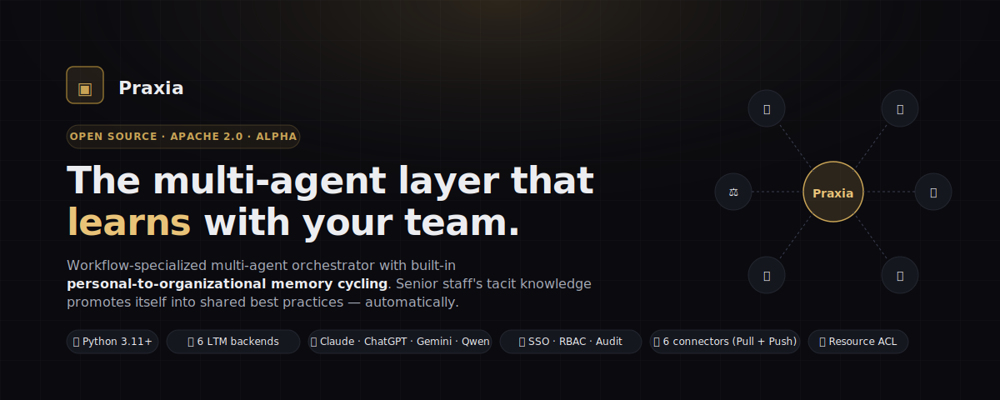
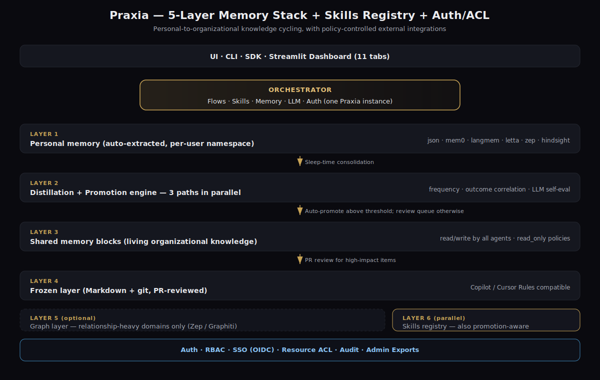
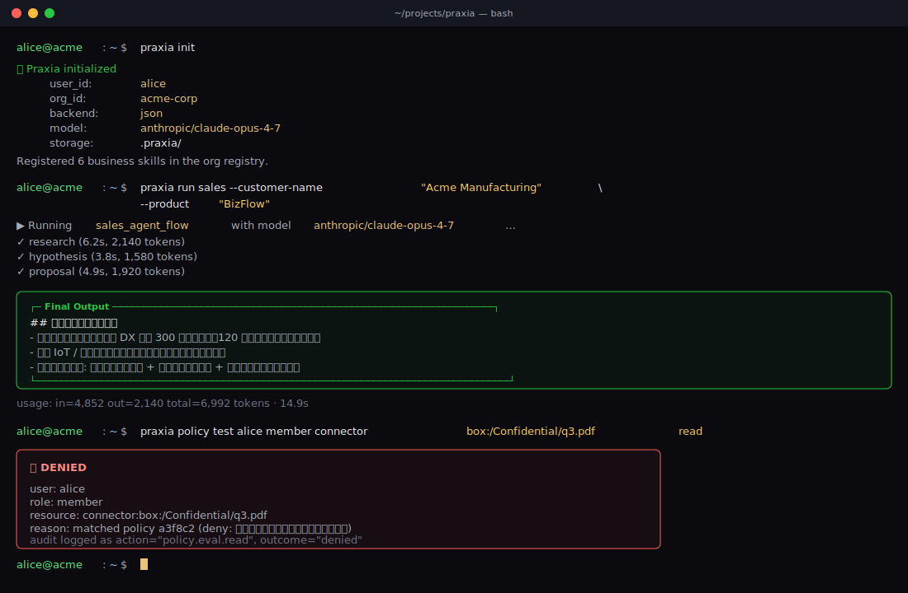

# Praxia
[](https://github.com/praxia-dev/praxia/actions/workflows/test.yml)
[](https://x.com/praxia_dev)

🌐 **Live**: [praxia.tools](https://praxia.tools/) (primary, Cloudflare) · [praxia-dev.github.io/praxia](https://praxia-dev.github.io/praxia/) (mirror, GitHub Pages) · [@praxia_dev](https://x.com/praxia_dev) on X



> **Specialized Multi-Agent Orchestrator with Cyclic Personal/Organizational Memory**
>
> A workflow-specific multi-agent orchestrator that **automatically promotes** individual tacit knowledge into organizational know-how. Built on a 5-layer memory stack with three independent promotion paths.

[](LICENSE)
[](https://www.python.org)
[]()
[]()
[]()
[]()
[]()

> 🔍 Complete feature reference: [docs/FEATURES.md](docs/FEATURES.md)
> 📊 Concrete Before/After tables: [docs/use-cases.md](docs/use-cases.md)

---

## 🎯 Why Praxia?

General-purpose multi-agent frameworks (CrewAI, AutoGen, LangGraph, …) are powerful but stop short on these four problems:

| Problem with existing frameworks | Praxia's approach |
|---|---|
| Setup is complex; production deployment is hard | **Workflow-specific templates** (sales prep / logic check / RAG optimization) that run in 5 minutes |
| Senior-engineer "magic prompts" stay locked in one person's editor | **Personal-to-org auto-promotion pipeline** built in |
| "It works" doesn't prove "it works *well*" | **Hallucination detection + retrieval evals** shipped by default |
| Agents stagnate after launch | **Sleep-time consolidation** distills your past flows nightly |

Praxia turns "one expert's drawer" into "everyone's best practices."

---

## 👥 Who Praxia is for

| Persona | What they need | How Praxia fits | Typical year-1 result |
|---|---|---|---|
| **🏢 Information Systems / Platform team** (300–5,000 employees) | Roll out AI tools without paywalled SSO/RBAC/audit, on-prem option | Auth + RBAC + ACL + per-user OAuth + audit log all in OSS, self-hostable | 100 KW × ~$1.25M net benefit, full audit trail |
| **🏗️ Engineering / Product VP** (50–500 in scope) | Senior architect bottleneck; junior PM 12–18mo ramp | DesignSkill + sleep-time consolidation distills senior review patterns; Markdown+git frozen layer fits PR workflow | Senior load 16h/wk → 4h/wk; junior ramp 6–9mo |
| **⚖️ Legal / Compliance lead** (regulated industry) | 50–100 contracts/mo bottleneck; need *auditable* AI workflow without lock-in | LegalSkill (RACE) + read-only memory mode + per-user OAuth + every action audited; Apache 2.0 source for auditors | 60–90min → 10–15min/contract; throughput 50–80/mo → 200–300/mo |
| **🧪 OSS / Research integrator** | Build domain agent system without re-implementing auth, memory cycling, exporters | 7 plugin types (~50 LoC each); use as library, run `praxia serve` as backend, embed in LangGraph | Day-30: domain skill + custom connector + memory cycling working — **~3 weeks ahead of from-scratch** |

Detailed Before/After by industry: [docs/use-cases.md](docs/use-cases.md).

---

## 💎 Why OSS matters here

The capabilities you typically pay enterprise tier for — already in the Apache 2.0 package:

- **SSO + RBAC + audit are not paywalled.** OIDC SSO (Google / Microsoft / Okta / GitHub / Keycloak) is in the OSS. Most agent frameworks ship without it; most agent platforms paywall it. Praxia treats it as table stakes.
- **Memory format is not locked in.** Layer 4 is plain Markdown in your git repo. Layer 3 exports to JSONL. Layer 1 is your chosen backend's native format. Leaving costs nothing.
- **You can read every line.** Apache 2.0. Show the source to your auditors, your security team, your customers.
- **Multi-LTM ensembles, not single-vendor.** Run Mem0 + Zep + HindSight in parallel, fuse with RRF, or route per query. No commercial agent platform exposes this — they pick a backend and lock you in.
- **Per-user OAuth respects external ACL.** When Alice pulls from Box, Box's own ACL applies — Alice only sees what Alice can see. Service-account designs (typical SaaS shortcut) leak data across users.
- **Air-gapped operation.** `PRAXIA_LOCAL_MODEL=gemma`, Ollama, `backend=json` — no cloud LLM, no cloud vector DB, no telemetry. Same code as cloud customers.
- **Production-grade OAuth + KMS in OSS.** Multi-worker safe state cache, 5 KMS adapters (AWS / Azure / GCP / Vault / local). Most agent platforms paywall this; Praxia ships it.
- **A/B experiments + quality eval included.** Test prompt variants on real users with deterministic assignment; catch LLM output quality regressions in CI.

---

## 🏗 Architecture — 5-Layer Memory Stack



The same picture as ASCII art:

```
┌──────────────────────────────────────────────────────────┐
│  AI Agents (Skills + MCP)                                │
└──────────────┬───────────────────────────────────────────┘
               │ Users just have normal conversations
               ▼
╔═══════════════════════════════════════════════════════════╗
║ Layer 1: Personal memory (auto-extracted)                 ║
║   Mem0 / LangMem / HindSight / Letta / Zep / JSON         ║
║   namespace = user_id                                     ║
║   ★ Zero-effort tacit-knowledge capture                   ║
╚══════════════╤════════════════════════════════════════════╝
               │ Sleep-time Consolidation (nightly batch)
               ▼
╔═══════════════════════════════════════════════════════════╗
║ Layer 2: Distillation & promotion engine                  ║
║   Three parallel "validity tests":                        ║
║     ① Frequency  (recurring across N+ users)              ║
║     ② Outcome    (correlated with wins/losses)            ║
║     ③ Self-eval  (LLM scored)                             ║
╚══════════════╤════════════════════════════════════════════╝
               │ Auto-promote above threshold; queue otherwise
               ▼
╔═══════════════════════════════════════════════════════════╗
║ Layer 3: Shared memory (living organizational knowledge)  ║
║   Letta-style shared blocks; all agents read/write        ║
╚══════════════╤════════════════════════════════════════════╝
               │ PR review for high-impact items
               ▼
╔═══════════════════════════════════════════════════════════╗
║ Layer 4: Frozen layer (git-managed best practices)        ║
║   Markdown + git + PR review                              ║
║   GitHub Copilot / Cursor Rules-compatible format         ║
╚══════════════╤════════════════════════════════════════════╝
               │ (optional)
               ▼
╔═══════════════════════════════════════════════════════════╗
║ Layer 5: Graph layer (only relationship-heavy domains)    ║
║   Zep / Graphiti — decisions, customer 360, incident DAG  ║
╚═══════════════════════════════════════════════════════════╝

Parallel Layer 6: Skills registry
  Personal skills get promoted to the organizational catalog.
  MCP / Claude Skills / Cursor Skills compatible.
```

Three promotion paths (**auto / statistical / manual**) run side by side — never depending on a single mechanism.

For details, see [docs/architecture.md](docs/architecture.md).

---

## ✨ What's Bundled

### Autonomous agent (LLM-driven tool-use loop)

`praxia.agent.AutonomousAgent` runs an LLM-driven tool-use loop over the
full Praxia stack — personal/org memory, skills, frozen layer, connectors —
with ACL checks and audit logging built in. The LLM picks tools on its own
until it has the information it needs, mirroring how modern code-editing assistants drives its
own tool use.

```python
from praxia.agent import AutonomousAgent
from praxia.core.llm import LLM

agent = AutonomousAgent(user_id="alice", org_id="acme", llm=LLM("claude"))
result = agent.run("Tell me what we know about Acme and draft a proposal.")
print(result.final_text)
```

```bash
praxia agent run "Summarize where we stand with Acme this quarter and draft a proposal"
praxia agent tools     # list the 11 built-in tools
```

The agent is also exposed as a single MCP meta-tool (`autonomous_agent`) so
remote clients (Claude Desktop, Cursor) can delegate an entire investigation
without orchestrating individual tools by hand. See
[FEATURES § 38](docs/FEATURES.md#38-autonomous-agent-llm-driven-tool-use-loop).

### 3 Specialized Multi-Agent Flows

| Flow | What it does |
|---|---|
| **SalesAgentFlow** | Reads customer IR, past minutes, RAG context → generates **hypotheses → FAQ → proposal outline** |
| **LogicCheckerFlow** | Three agents (structure / contradiction / reader) review long documents for logical consistency |
| **RAGOptimizationFlow** | Self-correcting RAG: query expansion → retrieval → relevance eval → hallucination check loop |

### 6 Default Business-Domain Skills

| Skill | Domain | Use cases |
|---|---|---|
| **InvestmentSkill** | Investment | Equity research, due diligence, portfolio decisions |
| **SalesSkill** | Sales | Account research, proposal drafting, FAQ prep |
| **DesignSkill** | Engineering Design | System design review, requirements engineering |
| **PurchasingSkill** | Procurement | Supplier evaluation, RFQ analysis, TCO, BCP risk |
| **PatentSkill** | IP / Patent | Prior-art search, claims drafting, patent maps |
| **LegalSkill** | Legal | Contract review, compliance, M&A diligence |

Each skill serializes to Claude-Skills / MCP-compatible `SKILL.md`.

Plus two **utility** skills:

| Skill | What it does |
|---|---|
| **`PromptDesignerSkill`** | Take a one-line task description → produce a production-grade prompt template (system + user + 2-3 few-shot examples + 5-criterion rubric) tuned for the target LLM (Claude / OpenAI / DeepSeek / Mistral / Llama / …). Save to `PromptStore`, A/B-test via `praxia.experiments`. |
| **`OutputFormatSkill`** | Detect "export as PowerPoint" / "as Word doc" / etc. in natural language (English + JA / ZH / KO / ES / FR / DE / PT-BR phrases also recognized) and dispatch to the matching exporter (PPTX / DOCX / HTML / MD / JSON). |

```bash
# Generate a prompt template for any task
praxia skill run prompt_designer "Have in-house legal score contract risk on a 5-point scale"
```

### All Major LLMs

LiteLLM-powered single-line provider switching:

| Provider | Aliases | Auth |
|---|---|---|
| Anthropic Claude | `claude` / `claude-sonnet` / `claude-haiku` | `ANTHROPIC_API_KEY` |
| OpenAI ChatGPT | `chatgpt` / `gpt-4o` / `o1` | `OPENAI_API_KEY` |
| Google Gemini | `gemini` / `gemini-flash` | `GEMINI_API_KEY` |
| Google Gemma (open) | `gemma` / `gemma-2b` / `gemma-9b` / `gemma-27b` (Ollama) · `gemma-cloud` (Vertex AI) | (none for local) / Vertex auth |
| Alibaba Qwen (cloud) | `qwen` / `qwen-72b` | `DASHSCOPE_API_KEY` |
| **DeepSeek** | `deepseek` (v3 chat) · `deepseek-reasoner` (R1) | `DEEPSEEK_API_KEY` |
| **Mistral** | `mistral` (large) · `mistral-small` · `codestral` | `MISTRAL_API_KEY` |
| **xAI Grok** | `grok` | `XAI_API_KEY` |
| **Llama (Groq fast)** | `llama` (3.3 70B Versatile via Groq) | `GROQ_API_KEY` |
| **Cohere** | `command-r` (Command R+) | `COHERE_API_KEY` |
| **Perplexity Sonar** | `perplexity` (web-search-augmented) | `PERPLEXITY_API_KEY` |
| **Microsoft Phi** (local) | `phi` (3.5 3.8B Ollama) | (none — runs in-house) |
| Qwen / Llama / Phi (local) | `qwen-local` · `llama-local` · `phi` (Ollama) | (none — runs in-house) |

```python
LLM("claude")        # Anthropic Claude
LLM("deepseek")      # DeepSeek v3 — strong + low cost
LLM("mistral")       # Mistral large — EU-friendly
LLM("llama")         # Llama 3.3 70B via Groq (fast)
LLM("gemma")         # Google Gemma 9B via local Ollama
LLM("phi")           # Microsoft Phi 3.5 — small / edge
LLM("qwen-local")    # Local Qwen via Ollama
LLM("openai/gpt-4o") # Any LiteLLM-compatible model string
```

### File parsing — PDF · Office · CSV · TXT · HTML · MD · code

Auto-dispatched by extension:

| Extension | Parser | Optional dep |
|---|---|---|
| `.txt` `.md` `.rst` `.py` `.ts` `.js` | TextParser | (none) |
| `.csv` `.tsv` | CsvParser | (stdlib) |
| `.json` `.yaml` `.yml` | StructuredParser | (core) |
| `.html` `.xml` | HtmlParser | (stdlib) |
| `.pdf` | PdfParser | `praxia[office]` |
| `.docx` | DocxParser | `praxia[office]` |
| `.pptx` | PptxParser | `praxia[office]` |
| `.xlsx` `.xlsm` | XlsxParser | `praxia[office]` |

```python
from praxia.io.parsers import parse_file

doc = parse_file("contract.pdf")          # works
doc = parse_file("Q3_results.xlsx")       # also works
print(doc.content)
```

Third-party formats register via `[project.entry-points."praxia.parsers"]` — no fork required.

### Output exporters — render skill output to HTML / PPTX / DOCX / MD / JSON

Skills produce Markdown by default. Convert to whatever the user requested:

```python
from praxia.io.exporters import export_as
result = export_as(md_text, format="pptx", title="Q3 Review")
# result.bytes → write to disk, stream over HTTP, push via a connector
```

`OutputFormatSkill` infers the format from natural-language hints across multiple languages:

```python
from praxia.skills.output_format import OutputFormatSkill
fs = OutputFormatSkill()
fs.detect("export as PowerPoint").format      # → "pptx"
fs.detect("as a Word document").format        # → "docx"
fs.deliver(md, user_request="HTML please")    # ExporterResult with .bytes
```

CLI shortcut:
```bash
praxia export report.md report.html
praxia export report.md slides.pptx --title "Q3 Review"
```

Custom formats register via the `praxia.exporters` entry-point — same pattern as connectors.

### Memory mode — accumulate or read-only, per user

Some sessions shouldn't leave a trail (legal review, sensitive data exploration). Toggle per-user:

```bash
praxia memory mode --user-id alice read_only      # writes silently dropped
praxia memory mode --user-id alice accumulate     # back on
praxia memory show --user-id alice                # see the resolved config + reason
```

Admins can lock the mode for the whole tenant or for specific roles:
```bash
praxia admin memory-policy-set --default-mode read_only --mode-locked
praxia admin memory-policy-set --enforced-backend mem0 --allowed mem0,zep
praxia admin memory-policy-set --accumulate-locked-roles operator,admin
```

Resolution order: admin enforced > call-site argument > user pref > admin default. See [`praxia.memory.policy`](praxia/memory/policy.py).

### Multi-LTM fusion + dynamic routing (accuracy boost)

Each LTM has different strengths — entity linking (Mem0), temporal KG (Zep), audit trail (JSON), vector recall (HindSight). You can run several at once and either fuse the results or pick per-query:

```python
from praxia.memory.composite import CompositeBackend, WeightedBackend
from praxia.memory.router import RoutedBackend, RuleRouter

# A. Parallel fan-out + Reciprocal Rank Fusion
composite = CompositeBackend(
    backends=[WeightedBackend("mem0", ..., weight=1.5),
              WeightedBackend("zep", ..., weight=1.0),
              WeightedBackend("hindsight", ..., weight=1.0)],
    fusion="rrf",
)

# B. Query-aware dispatch (RuleRouter handles English + Japanese keywords)
routed = RoutedBackend(
    backends={"mem0": ..., "zep": ..., "hindsight": ..., "json": ...},
    router=RuleRouter(),
    write_to="mem0",
)
```

Full design + tradeoffs: [docs/FEATURES.md § 5.1](docs/FEATURES.md#51-multi-ltm-fusion--dynamic-routing-accuracy-boost).

### Voice input / output

```python
from praxia.io.audio import STT, TTS

text = STT().transcribe(audio_bytes, filename="meeting.wav", language="ja")
audio = TTS().synthesize("Hello world", voice="alloy", format="mp3")
```

Both Streamlit UI tabs (Run Flow, Skill) include `🎙 Audio input` and `🔊 Read response aloud` toggles. Providers: OpenAI Whisper / TTS (default), ElevenLabs (premium voices), local Whisper / Piper (`praxia[audio-local]`).

### 6 Pluggable LTM Backends

| Backend | Notes |
|---|---|
| **json** (default) | Zero-dependency, JSONL on disk, fully auditable |
| **mem0** | Entity linking + hybrid search (recommended for production) |
| **langmem** | LangChain LangMem SDK |
| **letta** | Letta shared blocks (with read-only policy support) |
| **zep** | Zep / Graphiti for temporal KGs (Layer 5) |
| **hindsight** | [vectorize-io/hindsight](https://github.com/vectorize-io/hindsight) — agent memory store |

Switch with one line:
```python
PersonalMemory(user_id="alice", backend="mem0")
```

### Built-in Authentication, RBAC, SSO & Resource Policies

- **API-key + JWT auth** (`praxia.auth`) with 4 default roles (`admin` / `operator` / `member` / `viewer`)
- **SSO via OIDC**: Google, Microsoft Entra ID, Okta, GitHub, Keycloak, custom OIDC, plus SAML skeleton
- **Resource access policies (ACL)** — glob-pattern allow/deny rules per resource (built for enterprise IS departments)
- **Append-only audit log** — every authn / authz / policy decision / privileged action recorded
- **Admin data exports** — CSV / JSON / JSONL dumps of audit, users, usage, memory, policies, shared blocks (chain-of-custody preserved)

### Admin User Management
- Create / read / update / delete users
- Activate / deactivate, role grants, API-key rotation
- All actions audited
- Available via CLI, Streamlit UI, and SDK

### Custom Prompts (per-user + admin-distributed)
- Users save personal prompts; admins promote them to org or distribute to specific users / roles
- Three scopes (personal / org / distributed) with merge precedence
- Same model as the skill registry

### Per-user OAuth for connectors

Each Praxia user can authorize external systems with **their own credentials** — the external system's native ACL is enforced per-user.

```bash
# Set the OAuth app credentials once
export PRAXIA_OAUTH_BOX_CLIENT_ID=...
export PRAXIA_OAUTH_BOX_CLIENT_SECRET=...

# Each user authorizes individually (CLI loopback)
praxia oauth start box --user-id alice
# → opens authorization URL → user logs in → redirect captures code
# → token saved encrypted to .praxia/auth/oauth_tokens.jsonl

# From now on, alice's connector calls use her token
praxia connector pull box 0 --user-id alice
# alice can only see Box folders alice has access to
```

Supported providers: Box, Microsoft (SharePoint/OneDrive), Dropbox, Google Drive, Salesforce. Tokens auto-refresh; access logged in audit log.

**Production HTTP callback** (`praxia serve`): four endpoints under `/api/v1/oauth/{provider}/`: `start`, `callback`, `status`, `revoke` (DELETE). State cache is multi-worker-safe (`PersistentStateStore` — TTL-pruned JSON), so the IdP redirect can land on any FastAPI worker. Set `PRAXIA_PUBLIC_URL` to pin the redirect URI.

### KMS-backed token encryption (production)

OAuth tokens use **envelope encryption**: a fresh 256-bit data key per write, AES-GCM payload encryption, and the data key wrapped by a configurable `KmsAdapter`. The master key never lives on the application host:

| Adapter | Install | Use |
|---|---|---|
| `local` (default) | (none) | dev / single-host |
| `aws` | `pip install 'praxia[kms-aws]'` | AWS KMS CMK |
| `azure` | `pip install 'praxia[kms-azure]'` | Azure Key Vault Keys |
| `gcp` | `pip install 'praxia[kms-gcp]'` | GCP Cloud KMS |
| `vault` | `pip install 'praxia[kms-vault]'` | HashiCorp Vault Transit |

```bash
export PRAXIA_KMS_ADAPTER=aws
export PRAXIA_KMS_KEY_ID=arn:aws:kms:us-east-1:111122223333:key/...
```

Legacy v0.1 tokens decode transparently — re-saving rewrites in the new envelope format.

### A/B experiments — prompts / skills / LLMs

Test variants of any payload (system prompt, LLM provider, memory backend) with deterministic per-user assignment + outcome tracking:

```bash
praxia experiment create proposal_v2 \
    --name "Proposal: shorter vs longer prompt" \
    --variants '{"control":{"prompt":"<800-word>"},"candidate":{"prompt":"<400-word>"}}' \
    --traffic-split "control=0.5,candidate=0.5"
praxia experiment start proposal_v2
# ...users run flows; outcomes recorded automatically...
praxia experiment results proposal_v2
# → 🏆 Tentative winner: candidate (confidence 0.41)
```

Same user always sees the same variant during the experiment (SHA-256 bucket). Audience filter (roles / users / time window). See [`praxia.experiments`](praxia/experiments/).

### LLM output quality evaluation

Separate from the deterministic regression suite — `tests/llm_eval/` runs **real LLM calls** and grades output against rubrics + a committed baseline. CI flags PRs where quality drops > 5 points:

```bash
# Skipped by default (requires API keys + costs tokens)
pytest tests/llm_eval -m llm_eval -v

# Update baselines after a known-good change
pytest tests/llm_eval --update-baselines

# Compare providers on the same cases
pytest tests/llm_eval --llm-eval-model gpt-4o
```

Built-in rubrics: keyword match, structure (heading) match, length band, must-not-contain, LLM-as-judge. One canonical case per business skill ships out of the box.

### External Connectors — 20 systems, Pull + Push

**Storage / Files (8)**

| Connector | Pull | Push | Auth |
|---|---|---|---|
| **Box** | ✅ folder → files | ✅ upload | OAuth2 / JWT |
| **SharePoint / M365** | ✅ | ✅ | Microsoft Entra |
| **Dropbox** | ✅ | ✅ | OAuth2 |
| **Google Drive** | ✅ | ✅ | OAuth / SA |
| **AWS S3** | ✅ bucket/prefix | ✅ object upload | IAM (boto3 chain) |
| **Azure Blob Storage** | ✅ | ✅ | DefaultAzureCredential / connstr / SAS |
| **GCS** | ✅ | ✅ | ADC / service account |
| **WebDAV / Nextcloud** | ✅ | ✅ | HTTP Basic |

**Knowledge / Docs (3)**

| Connector | Pull | Push | Auth |
|---|---|---|---|
| **Notion** | ✅ database query | ✅ child page | OAuth (Notion) |
| **Confluence** | ✅ CQL search | ✅ child page | OAuth (Atlassian) |
| **Jira** | ✅ JQL search | ✅ create issue | OAuth (Atlassian) |

**Communication (3)**

| Connector | Pull | Push | Auth |
|---|---|---|---|
| **Slack** | ✅ history / search | ✅ post message | OAuth (Slack) |
| **Microsoft Teams** | ✅ channel messages | ✅ post message | OAuth (Microsoft) |
| **Email** (IMAP / Gmail / Outlook) | ✅ folder + query | ✅ send | IMAP/SMTP / Google / Microsoft OAuth |

**CRM / Tickets / Engineering (5)**

| Connector | Pull | Push | Auth |
|---|---|---|---|
| **kintone** | ✅ | ✅ | API token |
| **Salesforce** | ✅ SOQL | ✅ sObject create | OAuth |
| **HubSpot CRM** | ✅ contacts/companies/deals | ✅ note attach | OAuth |
| **Zendesk** | ✅ ticket search | ✅ create ticket | OAuth or API token |
| **GitHub** | ✅ issues/code/files | ✅ issue / comment | OAuth (GitHub) |
| **Linear** | ✅ issues by team | ✅ create issue | OAuth or API key |

Pull data into agent flows; push agent outputs back to your system of record. All access subject to admin policies. **Per-user OAuth** means alice only sees what alice has access to in each system.

### Dashboards
- **Personal**: 3 headline KPIs (total runs · success rate · memory entries) + Top skills horizontal bar chart
- **Organizational**: 3 headline KPIs (active users · org runs · success rate) + Top users / Top skills side-by-side bar charts
- Charts use plotly with the Praxia gold palette; tabular fallback if plotly isn't installed

---

## 🖼 UI Tour

The bundled Streamlit UI puts the **non-power-user surface area** of Praxia on a clean 3-zone layout: a sticky top-bar navigation, a sidebar dedicated to data context, and a workspace per view.

```
┌──────────────────────────────────────────────────────────────────────┐
│  [🎬 Run] [🧠 Knowledge] [📝 Prompts] [📁 Data] [📊 Stats]            │ ← sticky top bar
│                  [👤 Preferences] [⚙ Admin]*                         │   (* admin/dev only)
├────────────────────────┬─────────────────────────────────────────────┤
│  🪡 Praxia              │                                             │
│  👤 alice · admin       │                                             │
│  [Sign out]             │   Selected view's workspace                 │
│  ───────────────        │                                             │
│  📁 Context             │   (Run = Agent chat or Skill form,          │
│  ☑ Personal memory      │    Knowledge = memories + skill registry,   │
│  ☑ Org memory           │    Data = folder CRUD,                      │
│  ☐ Frozen layer         │    Prompts = generate/edit/distribute,      │
│  📁 Q3 Sales (12)       │    Stats = charts,                          │
│  🔌 Box: /Customers     │    Preferences = language/theme,            │
│                         │    Admin = settings/users/policies/...)     │
└────────────────────────┴─────────────────────────────────────────────┘
```

**Login**: just User ID for single-user dev mode, or User ID + Password (= API key issued by `praxia user create`) for role-gated multi-user mode.

**Run** is the high-frequency view with two sub-tabs:
- **🤖 Agent** — chat interface backed by `AutonomousAgent`. Type a goal; the LLM picks tools (search, connectors, skills) and iterates. Selected Context folders are passed in as additional reference data, with grep-based relevance filtering on large folders.
- **🛠 Skill** — pick a domain skill (investment / sales / design / purchasing / patent / legal), fill the input, click Run. Single-call, single-answer.

**Knowledge** shows browseable personal + shared memory, plus the skill registry (your skills + org-promoted ones). **Data folders** are how you create/manage local-upload folders or register external paths (Box / SharePoint / Notion / etc.). Selected folders feed the Run workspace via the sidebar Context picker.

**Admin** (admin role only) consolidates 7 sub-tabs: Settings (language, runtime LLM/backend, persistent API keys), Users, Connectors, Policies (ACL), Consolidate (sleep-time promotion), Exports (audit / users / memory / policies CSV/JSON/JSONL), About.

CLI users get the same functionality with rich-formatted output:



---

## 🚀 Quickstart

```bash
# 1. Install (pick the extras you actually need)
pip install praxia                              # Core
pip install "praxia[ui,connectors,office,audio]" # Common stack
pip install "praxia[all]"                       # Everything

# 2. Configure once — all keys live in one place
praxia config init      # interactive walkthrough
praxia config show      # display resolved config (secrets masked)
praxia config path      # show key resolution order
# Or: cp .env.example .env  and edit

# 3. Initialize
praxia init --backend json --model auto

# 4. Run a flow (auto-parses .pdf / .docx / .xlsx / .pptx if attached)
praxia run sales --customer-name "Acme" --product "BizFlow"
praxia run logic --document spec.pdf
praxia run rag --question "What license is Praxia released under?"

# Run a business skill
praxia skill run investment "Mid-term thesis on a hypothetical mid-cap electronics issuer"
praxia skill run legal "Review the risk in this services agreement"

# Launch the UI — sticky top-bar nav: Run / Knowledge / Prompts / Data /
# Stats / Preferences (+ Admin for admin role). Login is User ID alone in
# single-user dev mode; User ID + Password (= API key from `praxia user
# create`) for role-gated multi-user mode.
praxia ui --port 8501

# Personal → org memory distillation
praxia consolidate --dry-run
praxia freeze --block team_norms

# Dashboards
praxia dashboard --scope personal --user-id alice
praxia dashboard --scope org

# Admin: user management
praxia user create alice --role member
praxia user update alice --role operator --email alice@a.test
praxia user deactivate alice
praxia user delete alice --yes
praxia user audit --limit 100

# Admin: resource access policies (ACL — for IS depts)
praxia policy add deny connector "box:/Confidential/*" \
    --principals "role:member,role:viewer" \
    --description "Lock Confidential folder to operators+"
praxia policy list
praxia policy test alice member connector box:/Confidential/q3.pdf read

# Admin: data exports (CSV / JSON / JSONL — every export audit-logged)
praxia admin export-audit audit.csv --since-days 30
praxia admin export-users users.json --format json
praxia admin export-memory ./memory_backup --all
praxia admin export-policies policies.json

# External connectors (Pull / Push, subject to ACL)
praxia connector list
praxia connector pull box 0 --limit 20 --save-to ./box_pulled
praxia connector push salesforce Lead lead.json
praxia connector pull kintone "42?status='open'"

# Custom prompts (per-user + admin distribution)
praxia prompt create my_qualifier prompt_body.txt
praxia prompt list
praxia prompt distribute curated_prompt body.md --target-roles member

# Skill registry — promotion and admin distribution
praxia skill promote --candidates
praxia skill distribute investment_analyst --target-roles member,operator
```

Minimal Python example:

```python
from praxia import Praxia
from praxia.flows import SalesAgentFlow
from praxia.skills import InvestmentSkill

m = Praxia(user_id="alice", default_model="claude")

# Run a multi-agent flow
result = m.run(SalesAgentFlow, inputs={
    "customer_name": "Acme",
    "product": "BizFlow",
})

# Run a single business skill
print(InvestmentSkill().run("3-year investment thesis on Acme Mfg (TYO:0000)"))

# Personal memory accumulates automatically — no explicit save needed.
# The nightly consolidator promotes effective patterns to org memory.
m.consolidate(dry_run=True)
```

Full guide: [docs/quickstart.md](docs/quickstart.md).

> **Deploying it?** Two paths — fastest is `praxia ui` (full-stack); for "Praxia as a brain behind your own frontend" use the SDK or `praxia serve` (HTTP API). Setup recipes: [docs/deployment-modes.md](docs/deployment-modes.md).
> **Building a connector?** Step-by-step recipe in [docs/CUSTOM_CONNECTORS.md](docs/CUSTOM_CONNECTORS.md). The pattern is ~50 lines + an entry-point.
> **Formal specs?** Basic design / I/F / detailed design / **functional spec** (EN + JA) under [docs/specs/](docs/specs/).
> **Regression suite?** 364 tests covering auth/memory/exporters/CLI/i18n/etc. — see [docs/EVALUATION.md](docs/EVALUATION.md).
> **Multilingual?** Landing page + Streamlit UI ship in 8 languages (en / ja / zh-CN / ko / es / fr / de / pt-BR) with browser-language auto-detection — see [docs/i18n.md](docs/i18n.md).
> **Contributing?** PRs require a DCO sign-off (`git commit -s …`). Trademark policy + GDPR notes for operators are in [docs/legal/](docs/legal/).
> **MCP for Claude Desktop / Cursor?** Local stdio (`praxia mcp serve`) or remote HTTP+SSE (`/api/v1/mcp` after `praxia serve`). Every skill + flow becomes an MCP tool automatically.
> **OAuth scopes for connectors?** Per-provider scopes, app registration steps, least-privilege alternatives in [docs/OAUTH_SCOPES.md](docs/OAUTH_SCOPES.md).
> **Mobile-friendly?** Both the landing page and the Streamlit UI are responsive — chip-style nav on phones, scrollable tabs, ≥44px touch targets, compact mode toggle.

---

## 📐 Design Philosophy

### 1. Capture tacit knowledge with **zero effort**
No explicit `CLAUDE.md`-style writing. Mem0/LangMem/HindSight extract entities and preferences from ordinary conversations.

### 2. Promote only what's **effective**, **automatically**
Three independent verdicts run in parallel. The framework auto-promotes only when consensus is high; medium-confidence items go to a review queue.

### 3. Separate "frozen" from "living" knowledge
- Living layer (shared blocks): updated instantly, all agents see it
- Frozen layer (Markdown + git): only PR-reviewed, stable best practices

This keeps both **freshness** and **trust** intact.

### 4. Use Graph storage **only where relationships are the value**
Mem0 OSS removed `graph_store` support in April 2026. We follow that signal: vector + entity linking is the default; graphs apply only to decision histories, customer 360, and incident causal chains.

### 5. **Vendor lock-in is a non-goal**
- LiteLLM lets any provider work
- LTM backends are pluggable — and you can run several at once via [CompositeBackend / RoutedBackend](docs/FEATURES.md#51-multi-ltm-fusion--dynamic-routing-accuracy-boost) for higher recall without picking a winner
- Markdown + git is the persistence layer of last resort
- Apache 2.0 license, evolving toward an open-core model

### 6. Ship "**evidence**" alongside the framework
Hallucination detection (`praxia.eval.hallucination`) and retrieval metrics (`praxia.eval.metrics`) are first-class. Customers don't have to take "it works" on faith.

For more, see [docs/design-philosophy.md](docs/design-philosophy.md).

---

## 📊 Use Cases by Industry

Detailed Before/After tables for each domain are in **[docs/use-cases.md](docs/use-cases.md)**. Highlights:

| Industry | Representative use case | Headline impact |
|---|---|---|
| Investment | Seed-stage VC due diligence | 4–6h → **45–60 min** per deck |
| Sales | Pre-meeting research + storyboard | Proposal-acceptance rate **+15–20pt** |
| Engineering Design | Requirements doc review | Senior architect time freed: **week 16h → 4h** |
| Procurement | RFQ TCO comparison | Hidden costs found: **+30%** vs initial quote |
| Patent | Prior-art search + novelty assessment | External patent-attorney fees **−50–70%** |
| Legal | M&A contract review | External law-firm costs **halved** (~$100k/deal) |

**3-year compounding effects**: New-hire ramp **6–12mo → 2–3mo** / Veteran-departure knowledge loss **→ zero** / Cross-team best-practice diffusion **30+ items/month**.

---

## 🆚 When to pick what

Praxia is opinionated for organizations that want **OSS + workflow templates
+ auto personal-to-org memory cycling + integrated auth/ACL/audit** all in
one library. Adjacent tools have different goals — pick the one that fits
your need:

- **[LangGraph](https://github.com/langchain-ai/langgraph)** — generic agent graph builder, fine-grained state machines, deep LangChain integration
- **[CrewAI](https://github.com/crewAIInc/crewAI)** — lightweight role-based crew abstraction
- **[AutoGen](https://github.com/microsoft/autogen)** — research-grade conversational multi-agents from Microsoft Research
- **[Glean](https://www.glean.com/)** — hosted enterprise knowledge platform (no operational burden, commercial)
- **[Mem0](https://github.com/mem0ai/mem0) / [LangMem](https://github.com/langchain-ai/langmem) / [Letta](https://github.com/letta-ai/letta) / [Zep](https://github.com/getzep/zep) / [HindSight](https://github.com/vectorize-io/hindsight)** — memory backends (Praxia uses them as plug-in backends, you can run several at once)

These are not mutually exclusive — Praxia uses Mem0 as a backend and can be
embedded inside a LangGraph node.

For a feature-level matrix, see [`docs/COMPARISON.md`](docs/COMPARISON.md)
(verifiable against each project's public documentation; corrections welcome
via Issues).

---

## 🗺 Roadmap

| Phase | Scope | Status |
|---|---|---|
| **Phase 1** | Personal memory + 3 specialized flows + 6 business skills | ✅ **Done** |
| **Phase 2** | Sleep-time consolidator + statistical (outcome-correlated) promotion | ✅ **Done** |
| **Phase 3** | Shared blocks + Markdown freeze workflow + CLI | ✅ **Done** |
| **Phase 4** | Skill registry promotion (personal → org) | ✅ **Done** |
| **Phase 5** | Auth + RBAC + SSO + audit log + admin user CRUD | ✅ **Done** |
| **Phase 5+** | Resource access policies (ACL) + admin data exports + custom prompts + 6 connectors + dashboards | ✅ **Done** |
| **Phase 6** | Multi-tenant SaaS, advanced GUI, vertical editions | 🚧 Commercial |

---

## 🤝 Contributing

We're building a **community-driven library of industry recipes**. Three primary contribution paths:

1. New workflow flows (`praxia/flows/`)
2. New business skills (`praxia/skills/business/`)
3. Industry recipes (`docs/recipes/`)

See [CONTRIBUTING.md](CONTRIBUTING.md).

---

## 📜 License

[Apache License 2.0](LICENSE) — commercial use, modification, and redistribution permitted.

**Copyright holder**: GenArch and Praxia Contributors.

Third-party dependencies retain their own licenses; see [NOTICE.md](NOTICE.md) for the full attribution list.

**Trademarks**: All product and company names referenced in Praxia documentation (Claude, ChatGPT, Gemini, Qwen, Box, SharePoint, Dropbox, Google Drive, kintone, Salesforce, Mem0, Letta, LangChain, CrewAI, Glean, etc.) are trademarks or registered trademarks of their respective owners. Praxia is not affiliated with, sponsored by, or endorsed by any of these companies — references are descriptive (nominative fair use) only. See [NOTICE.md § Trademark notice](NOTICE.md#trademark-notice) for the full list.

**Demo data**: Company names in code examples (e.g., "Acme Manufacturing", "AcmeAuto Inc.") are **fictional** and for illustration only. Built-in skills include guardrails reminding users that final professional advice (investment, legal, patent, etc.) requires a qualified professional.

We may evolve toward an **open-core** model: enterprise GUI / advanced audit features under a separate license, while the framework remains Apache 2.0.

---

## 🚢 Deployment modes

Praxia ships in two halves you can mix:

| Mode | What you run | When to choose it |
|---|---|---|
| **A. Full-stack** | `praxia ui` (Streamlit) + Praxia core, one process | Internal team, fastest path |
| **B-1. Embedded SDK** | Your Python service `import praxia` | You already have a Python backend |
| **B-2. HTTP service** | `praxia serve` (FastAPI) + your own frontend | Non-Python frontend, mobile, or CDN-cached UI |

Both modes share the same auth, memory, and skills — only the frontend differs. Step-by-step setup, production checklist, and migration path: [docs/deployment-modes.md](docs/deployment-modes.md) ([JA](docs/deployment-modes.ja.md)).

```bash
# Full-stack
praxia ui --port 8501

# Backend-only HTTP API (8 endpoints under /api/v1)
pip install "praxia[server]"
praxia serve --host 0.0.0.0 --port 8000 --cors-origin https://your-frontend.example
```

---

## 📐 Design specs (formal documents)

For procurement / architecture review / extension work, formal design specs are available in **EN + JA**:

| Document | English | JA |
|---|---|---|
| Basic design | [basic-design.en.md](docs/specs/basic-design.en.md) | [basic-design.ja.md](docs/specs/basic-design.ja.md) |
| Interface spec | [interface-spec.en.md](docs/specs/interface-spec.en.md) | [interface-spec.ja.md](docs/specs/interface-spec.ja.md) |
| Detailed design | [detailed-design.en.md](docs/specs/detailed-design.en.md) | [detailed-design.ja.md](docs/specs/detailed-design.ja.md) |
| Functional spec | — | [functional-spec.ja.md](docs/specs/functional-spec.ja.md) |

---

## 🛠 Extending Praxia

Praxia uses a **single extensibility primitive** (`praxia.extensions.Registry`) for every plugin point — connectors, memory backends, skills, flows, file parsers, output exporters, OAuth providers. Adding a plugin **does not require editing any core file**.

| Plugin type | Base | Registry | Entry-point group | Lines |
|---|---|---|---|---|
| Connector | `Connector` protocol | `CONNECTORS` | `praxia.connectors` | ~50 |
| Memory backend | `MemoryBackend` protocol | `BACKENDS` | `praxia.memory_backends` | ~80 |
| File parser | `Parser` protocol | `PARSERS` | `praxia.parsers` | ~30 |
| Output exporter | `Exporter` protocol | `EXPORTERS` | `praxia.exporters` | ~40 |
| OAuth provider | `OAuthProviderConfig` | (instance) | `praxia.oauth_providers` | ~10 |
| KMS adapter | `KmsAdapter` protocol | `KMS_ADAPTERS` | `praxia.kms_adapters` | ~30 |
| Business skill | `Skill` | `SKILLS` | `praxia.skills` | ~20 |
| Multi-agent flow | `Flow` | `FLOWS` | `praxia.flows` | ~30 |
| Industry recipe | Markdown | n/a | — | n/a |

**Custom connector tutorial** (end-to-end Notion example): [docs/CUSTOM_CONNECTORS.md](docs/CUSTOM_CONNECTORS.md) ([JA](docs/CUSTOM_CONNECTORS.ja.md)).

**Two ways to register**:

```python
# (a) Decorator (in-tree contributions)
from praxia.connectors.registry import CONNECTORS

@CONNECTORS.register_decorator("notion")
class NotionConnector: ...
```

```toml
# (b) Entry-point (third-party packages — no fork needed)
[project.entry-points."praxia.connectors"]
notion = "praxia_connector_notion:NotionConnector"
```

After `pip install praxia-connector-notion`, the new connector shows up automatically in `praxia connector list`, the Streamlit UI, and the SDK — with **no edit to Praxia itself**.

Full guide with examples for all 4 plugin types: **[docs/PLUGINS.md](docs/PLUGINS.md)**.

---

## 📈 ROI estimate (100-knowledge-worker mid-cap)

| Variable | Year 1 | Year 2 |
|---|---|---|
| Workers in scope (N) | 100 | 100 |
| Loaded cost / FTE (C) | $90k | $90k |
| Routine work share (t) | 40% | 40% |
| Time savings (s) | 35% | 60% |
| Quality lift (Q) | $65k | $200k |
| Praxia cost (P) | $80k | $80k |
| **Net benefit** | **$1.25M** | **$2.30M** |

3-year cumulative net ≈ **$5.2M**. Even halving every parameter still produces > 10× ROI.

Full model + worked examples: [docs/FEATURES.md#roi-projection-model](docs/FEATURES.md#14-roi-projection-model).

---

## 📚 Acknowledgements & Inspirations

- [Mem0](https://github.com/mem0ai/mem0) — personal memory layer
- [Letta](https://github.com/letta-ai/letta) — shared memory blocks concept
- [LangMem](https://github.com/langchain-ai/langmem) — long-term memory SDK
- [LiteLLM](https://github.com/BerriAI/litellm) — unified provider abstraction
- [Claude Skills](https://docs.claude.com/) — skills registry conventions
- [Model Context Protocol](https://modelcontextprotocol.io) — tool/skill interop
- HindSight — Experience / Entity Summary / Belief model

Theoretical groundwork:
- LinkedIn Cognitive Memory Agent (Episodic + Semantic + Procedural)
- Mem0 paper (arXiv:2504.19413)
- Letta sleep-time agents

---

> **Mission**: Bridge "individual brilliance" and "organizational continuity" with AI.
