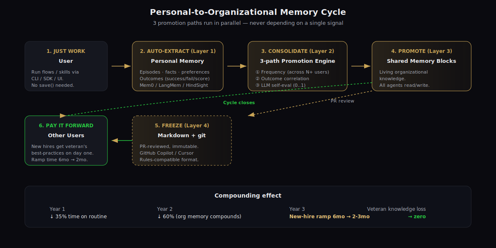
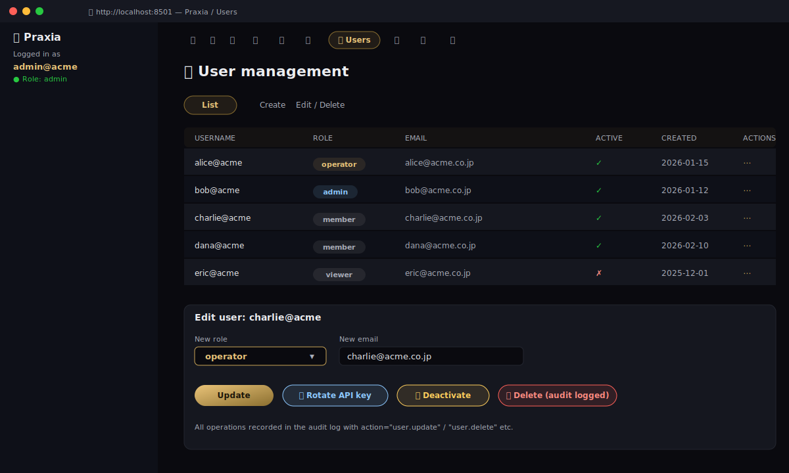
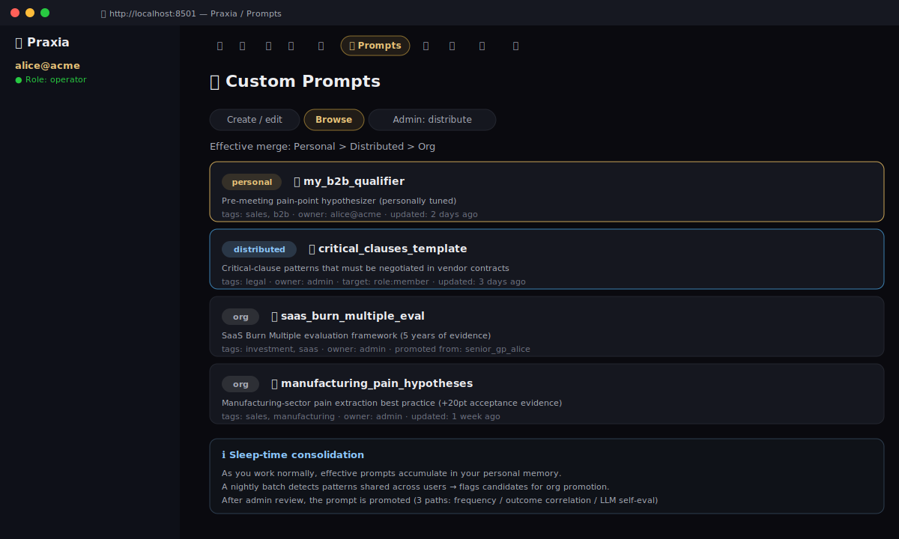

# Praxia — Complete Feature Reference


Everything Praxia ships, organized for evaluators, integrators, and adopters.

> Looking for a quick overview? Start with [README.md](../README.md).
> Need workflow-specific Before/After tables? See [docs/use-cases.md](use-cases.md).
> Need extensibility patterns? See [Extending Praxia](#extending-praxia) below.

---

## Table of contents

1. [Core capabilities](#1-core-capabilities)
2. [Multi-agent flows](#2-multi-agent-flows)
3. [Business-domain skills](#3-business-domain-skills)
4. [Memory layers (5+1)](#4-memory-layers-51)
5. [LTM backend matrix](#5-ltm-backend-matrix)
6. [LLM provider matrix](#6-llm-provider-matrix)
7. [Promotion engine (3-path)](#7-promotion-engine-3-path)
8. [Evaluation tooling](#8-evaluation-tooling)
9. [Authentication, RBAC, audit, SSO](#9-authentication-rbac-audit-sso)
10. [Default UI](#10-default-ui)
11. [CLI command reference](#11-cli-command-reference)
12. [Unique advantages over competitors](#12-unique-advantages-over-competitors)
13. [Extending Praxia](#13-extending-praxia)
14. [ROI projection model](#14-roi-projection-model)
15. [Roadmap & extensibility](#15-roadmap--extensibility)
16. [FAQ](#16-faq)
17. [Admin user management](#17-admin-user-management)
18. [Custom prompts (per-user + admin distribution)](#18-custom-prompts)
19. [Resource access policies (ACL)](#19-resource-access-policies-acl)
20. [Admin data exports](#20-admin-data-exports)
21. [External connectors (Pull + Push)](#21-external-connectors)
22. [Personal & organizational dashboards](#22-dashboards)
23. [File parsers (PDF / Office / CSV / HTML / text)](#23-file-parsers-pdf--office--csv--html--text)
24. [Audio I/O — voice input + voice output](#24-audio-io--voice-input--voice-output)
25. [User-delegated OAuth](#25-user-delegated-oauth-per-user-external-system-access)
26. [Memory mode toggle (accumulate vs read-only)](#26-memory-mode-toggle-accumulate-vs-read-only)
27. [Admin-controlled LTM policy](#27-admin-controlled-ltm-policy)
28. [Output exporters (HTML / PPTX / DOCX / MD / JSON)](#28-output-exporters-html--pptx--docx--md--json)
29. [Gemma support](#29-gemma-support-googles-open-weight-family)
30. [Deployment modes (frontend-included vs backend-only)](#30-deployment-modes-frontend-included-vs-backend-only)
31. [Custom connector guide](#31-custom-connector-guide)
32. [Design specifications](#32-design-specifications)
33. [KMS-backed token encryption](#33-kms-backed-token-encryption-production-oauth)
34. [OAuth callback web handler](#34-oauth-callback-web-handler-production-http)
35. [A/B experiments framework](#35-ab-experiments-framework-praxiaexperiments)
36. [LLM output quality evaluation](#36-llm-output-quality-evaluation-testsllm_eval)
37. [Legal templates](#37-legal-templates)
38. [Autonomous agent (LLM-driven tool-use loop)](#38-autonomous-agent-llm-driven-tool-use-loop)

---

## 1. Core capabilities

| Capability | Status | Description |
|---|---|---|
| Autonomous agent (LLM-driven) | ✅ | LLM-driven tool-use loop over personal/org memory + skills + connectors — see [§ 38](#38-autonomous-agent-llm-driven-tool-use-loop) |
| Multi-agent orchestration | ✅ | Declarative `Flow` of `FlowStep`s with `${var}` template substitution |
| Workflow-specialized templates | ✅ | 3 production-ready flows + community-contributable recipes |
| Auto-extracting personal memory | ✅ | Layer 1; no explicit `save()` calls in business code |
| Sleep-time consolidation | ✅ | Layer 2; nightly batch promotes effective patterns |
| 3-path promotion (freq / outcome / self-eval) | ✅ | Statistical + LLM + frequency-based, run in parallel |
| Shared memory blocks | ✅ | Layer 3; living organizational knowledge with `read_only` policies |
| Markdown + git frozen layer | ✅ | Layer 4; PR-reviewed, GitHub Copilot / Cursor Rules compatible |
| Optional graph layer | ✅ | Layer 5; only for relationship-heavy domains |
| Skills registry promotion | ✅ | Layer 6; promotes skills, not just memory entries |
| 6 default business skills | ✅ | Investment / Sales / Design / Purchasing / Patent / Legal |
| 6 LTM backends | ✅ | json / mem0 / langmem / letta / zep / hindsight |
| Multi-LLM provider | ✅ | Claude / ChatGPT / Gemini / Qwen-API / Qwen-local + 100+ via LiteLLM |
| Built-in evaluation | ✅ | Hallucination check + retrieval metrics |
| Auth + RBAC + audit | ✅ | API key + JWT + 4 roles + append-only audit log |
| SSO (OIDC) | ✅ | Google / Microsoft / Okta / GitHub / Keycloak / custom |
| Resource access policies (ACL) | ✅ | Glob-pattern allow/deny rules per resource type, principal, action — built for IS depts |
| Admin user CRUD | ✅ | Create / read / update / delete / deactivate / rotate keys |
| Admin data exports | ✅ | CSV / JSON / JSONL exports of audit, users, usage, memory, policies |
| External connectors (Pull + Push) | ✅ | Box, SharePoint/OneDrive/Teams, Dropbox, Google Drive, kintone (OAuth), Salesforce, Notion, Confluence, Jira, Slack, HubSpot, Zendesk, GitHub, Linear, S3, GCS, Azure Blob, WebDAV, Email |
| Custom prompts (per-user + admin distribute) | ✅ | Personal / org / distributed scopes with role targeting |
| Personal & organizational dashboards | ✅ | Flow/skill counts, success rate, top users, promoted blocks |
| File parsing (PDF / Word / PPT / Excel / CSV / HTML) | ✅ | Auto-dispatch parser by extension; pluggable via entry points |
| Voice input / output (STT + TTS) | ✅ | OpenAI Whisper / TTS by default; ElevenLabs / local Whisper / Piper supported |
| User-delegated OAuth (per-user connector auth) | ✅ | Box / Microsoft / Dropbox / Google / Salesforce / Notion / Atlassian / Slack / GitHub / HubSpot / Zendesk / Linear / kintone — external ACL enforced per Praxia user. Self-service UI under Preferences → Service Connections. |
| Legal templates (Terms / Privacy / AUP / Cookies) | ✅ | Starter templates in docs/legal/ for portal sign-up + commercial use |
| Default Streamlit UI | ✅ | 5-tab dashboard for non-technical users |
| MCP / Claude Skills compatibility | ✅ | Skills serialize to standard `SKILL.md` format |
| Outcome tracking | ✅ | `record_outcome()` for statistical promotion |
| Open Core license model | ✅ | Apache 2.0 core, commercial extras planned |

---

## 2. Multi-agent flows

### SalesAgentFlow

Three-agent pipeline:

| Step | Role | Output |
|---|---|---|
| `research` | Account researcher | Public IR / press / industry context |
| `hypothesis` | Pain hypothesizer | Top-3 customer pain hypotheses + product fit |
| `proposal` | Proposal writer | FAQ table + proposal outline |

```python
from praxia import Praxia
from praxia.flows import SalesAgentFlow

p = Praxia(user_id="alice", default_model="claude")
result = p.run(SalesAgentFlow, inputs={
    "customer_name": "Acme Manufacturing",
    "product": "Praxia Sales",
    "additional_context": "Mid-term plan calls for 30B JPY DX investment",
})
print(result.final_output)
```

```bash
praxia run sales --customer-name "Acme" --product "Praxia Sales"
```

### LogicCheckerFlow

| Step | Role | Output |
|---|---|---|
| `structure` | Structure extractor | Document tree + gap markers |
| `contradiction` | Contradiction detector | Inconsistencies + unfulfilled set-ups |
| `reader_perspective` | Target-reader simulator | Friction points + clarity score (10-pt) |

Use cases: long reports, manuals, novels, RFP responses.

### RAGOptimizationFlow

| Step | Role | Output |
|---|---|---|
| `query_rewriter` | Query expander | 3 alternative queries (keyword / NL / synonym) |
| `retrieval` | Pluggable retriever | Combined chunks |
| `evaluator` | Relevance scorer | Score 0..1 + missing-info gaps |
| `answerer` | Grounded answerer | Cited answer or "insufficient information" |
| `hallucination_check` | Verifier | Sentence-level grounded/ungrounded verdicts |

Plug in your retriever via the `retriever` input — any callable matching
`(query: str) -> list[dict]`.

---

## 3. Business-domain skills

Each skill ships with a battle-tested system prompt **plus guardrails**
(licensing reminders, jurisdictional caveats, hallucination guards).

### InvestmentSkill (`investment_analyst`)

Built-in framework: 5-step (Profile → Quant → Qual → Risk → Decision).

```bash
praxia skill run investment "Mid-term thesis on a hypothetical mid-cap electronics issuer"
```

```python
from praxia.skills import InvestmentSkill
print(InvestmentSkill().run("3-year thesis on Acme Mfg (TYO:0000) — fictional issuer"))
```

Guardrails: includes "final decision is yours" disclaimer, NISA tax notes,
explicit confidence-interval framing.

### SalesSkill (`sales_strategist`)

Framework: 4P (Profile / Pain / Power / Proposal).

```bash
praxia skill run sales "Acme Mfg, mid-cap electronics, our product: BizFlow"
```

Output: executive summary → customer profile → top-3 hypotheses → 5-row FAQ.

### DesignSkill (`design_reviewer`)

Framework: DRAGON (Data flow / Requirements traceability / Architectural fit /
Gaps / Operation / NFRs).

```bash
praxia skill run design "Review this design doc: $(cat spec.md)"
```

Output: review summary (Approve / Request Changes / Reject) + severity-tagged
issues + before/after code blocks.

### PurchasingSkill (`purchasing_analyst`)

Framework: QCD+S (Quality / Cost / Delivery + Sustainability) + geopolitical
risk + Subcontract Act compliance.

```bash
praxia skill run purchasing "Evaluate 5 suppliers for our PCB sourcing"
```

Output: 5-row supplier comparison + TCO breakdown + risk matrix + recommended
actions (immediate / mid / long).

### PatentSkill (`patent_analyst`)

Framework: 5-step prior-art search (element extraction → search formula →
hit analysis → novelty → inventive step) + claims drafting principles.

```bash
praxia skill run patent "Prior-art search: solid-state battery with X structure"
```

Guardrails: "final filing requires patent attorney review" reminder.

### LegalSkill (`legal_reviewer`)

Framework: RACE (Risk / Allocation / Compliance / Exit) + 🔴/🟡/🟢 severity
ladder.

```bash
praxia skill run legal "Review NDA: $(cat nda.txt)"
```

Guardrails: "lawyer required for final advice" reminder, references statute
revisions.

---

## 4. Memory layers (5+1)




| Layer | Class | Persistence | Lifecycle |
|---|---|---|---|
| 1 | `PersonalMemory` | Per-user JSONL or LTM backend | Auto-extracted from each interaction |
| 2 | `SleepTimeConsolidator` + `PromotionEngine` | Stateless (reads L1, writes L3 / review queue) | Nightly batch |
| 3 | `SharedMemory` | Per-org JSONL | Mutable, all agents read/write |
| 4 | `MarkdownStore` | git-tracked Markdown files | PR-reviewed, immutable until merged |
| 5 | Graph backend (optional) | Neo4j / Zep / Graphiti | Manual or batch ingestion |
| 6 | `SkillRegistry` | Per-user → org file tree | Promotes when usage thresholds met |

### Layer 1 — auto-extraction in action

```python
# These three lines accumulate memory implicitly. No explicit save().
result = p.run(SalesAgentFlow, inputs={...})
p.run(LogicCheckerFlow, inputs={...})
p.run(SalesAgentFlow, inputs={...})

# Each run stores an "episode" + extracted facts/preferences.
all_entries = p.personal_memory.all_entries()
print(len(all_entries))  # → 3+ entries
```

### Layer 2 — promotion in action

```python
# Run nightly (or on-demand)
report = p.consolidate(dry_run=False)
print(report)
# {
#   "candidates_evaluated": 12,
#   "auto_promoted": 3,           # high-confidence patterns moved to L3
#   "review_queued": 5,           # mid-confidence; need human review
#   "skipped": 4,
#   "verdicts": [...]
# }
```

### Layer 3 → Layer 4 — freezing

```bash
praxia freeze --block manufacturing_pain_hypotheses
# → .praxia/frozen/instructions/manufacturing_pain_hypotheses.md (git-tracked)
```

---

## 5. LTM backend matrix

| Backend | Auto-extract | Vector search | Entity linking | Relationship graph | Production-ready | Cost |
|---|---|---|---|---|---|---|
| **json** (default) | ❌ | BM25-like | ❌ | ❌ | Dev / SMB | Free |
| **[mem0](https://github.com/mem0ai/mem0)** | ✅ | ✅ hybrid | ✅ | ❌ (since 2026-04) | ✅ recommended | LLM tokens |
| **[langmem](https://github.com/langchain-ai/langmem)** | ✅ | ✅ | ✅ | ❌ | ✅ (LangChain shop) | LLM tokens |
| **[letta](https://github.com/letta-ai/letta)** | ✅ | ✅ | ❌ | ❌ | ✅ | Letta service |
| **[zep](https://github.com/getzep/zep)** | ✅ | ✅ | ✅ | ✅ temporal KG | ✅ (Layer 5) | Zep service |
| **[hindsight](https://github.com/vectorize-io/hindsight)** | ✅ | ✅ | ❌ | ❌ | ✅ | Vectorize service / self-host |

```python
PersonalMemory(user_id="alice", backend="mem0")          # recommended
PersonalMemory(user_id="alice", backend="hindsight",
               api_url="https://hindsight.example.com")  # vectorize-io
PersonalMemory(user_id="alice", backend="zep")           # for graph use
```

### 5.1 Multi-LTM fusion + dynamic routing (accuracy boost)

A single backend has a single failure mode. Praxia ships two composition
primitives that combine multiple LTMs to lift recall and precision —
without forcing you to pick a winner.

**A. `CompositeBackend` — parallel fan-out + fusion**
Fires the same query at all configured backends in parallel and merges the
result lists. Five fusion strategies:

| Strategy | When to use |
|---|---|
| `rrf` (default) | Reciprocal Rank Fusion — score-agnostic, robust baseline (Cormack et al. SIGIR 2009) |
| `union` | Concatenate + dedupe — maximal recall |
| `intersection` | Keep items found by ≥ N backends — high precision |
| `weighted` | Per-backend weights × normalized rank score |
| `llm_rerank` | LLM-as-judge reranks the candidate pool — slowest, most accurate |

```python
from praxia.memory.composite import CompositeBackend, WeightedBackend
from praxia.memory.backends import load_backend

composite = CompositeBackend(
    backends=[
        WeightedBackend("mem0",      load_backend("mem0"),      weight=1.5),
        WeightedBackend("zep",       load_backend("zep"),       weight=1.0),
        WeightedBackend("hindsight", load_backend("hindsight"), weight=1.0),
        WeightedBackend("json",      load_backend("json"),      weight=0.5),
    ],
    fusion="rrf",
    write_to="mem0",  # writes go here only; reads fan-out
)
PersonalMemory(user_id="alice", backend=composite)
```

A single backend failing is non-fatal — the fan-out catches the exception
and continues with the remaining results.

**B. `RoutedBackend` — query-aware dispatch**
Inspects the query and picks the best backend(s) per call:

| Query shape | Backends preferred | Why |
|---|---|---|
| Temporal (`last week`, `先月`) | zep → mem0 → hindsight | Time-axis KG |
| Audit (`changelog`, `履歴`) | json → mem0 | Exact-recall append-only log |
| Entity (`who is...`, `について`) | mem0 → hindsight → json | Entity linking |
| Similarity (`similar`, `類似`) | hindsight → mem0 → letta | Vector search |
| (none of the above) | mem0 + hindsight + json | Default ensemble |

Two routers ship in the box:
- `RuleRouter` — regex-based, deterministic, transparent (recommended default)
- `LLMRouter` — LLM classifies the query intent (highest accuracy, costs an extra call)

```python
from praxia.memory.router import RoutedBackend, RuleRouter

rb = RoutedBackend(
    backends={
        "mem0": load_backend("mem0"),
        "zep": load_backend("zep"),
        "hindsight": load_backend("hindsight"),
        "json": load_backend("json"),
    },
    router=RuleRouter(),  # or LLMRouter(llm=praxia.llm)
    write_to="mem0",
)
PersonalMemory(user_id="alice", backend=rb)
```

When the router picks a single backend, the call is direct (no fusion
overhead). When it picks several, fan-out + RRF runs automatically.

**Cost / latency tradeoff:**
- Composite (4 backends, RRF) ≈ slowest backend's latency (parallel) + ms-level fusion overhead
- Routed (single-backend route) ≈ same as the chosen backend
- Routed (multi-backend route) ≈ same as composite for those backends
- LLMRouter adds one classification round-trip (~200–500 ms)

---

## 6. LLM provider matrix

| Provider | Aliases | API key env var | Best for |
|---|---|---|---|
| Anthropic | `claude` / `claude-sonnet` / `claude-haiku` | `ANTHROPIC_API_KEY` | Reasoning, long-form |
| OpenAI | `chatgpt` / `gpt-4o` / `o1` | `OPENAI_API_KEY` | Tool use, breadth |
| Google | `gemini` / `gemini-flash` | `GEMINI_API_KEY` | Long-context, multimodal |
| Google Gemma (open) | `gemma` / `gemma-2b` / `gemma-9b` / `gemma-27b` · `gemma-cloud` | (Ollama) / Vertex auth | Open weights, edge to 27B |
| Alibaba | `qwen` / `qwen-72b` | `DASHSCOPE_API_KEY` | Cost / Chinese-language |
| **DeepSeek** | `deepseek` (v3) / `deepseek-reasoner` (R1) | `DEEPSEEK_API_KEY` | Frontier quality at ~1/10 cost; R1 for chain-of-thought |
| **Mistral** | `mistral` / `mistral-small` / `codestral` | `MISTRAL_API_KEY` | EU compliance angle; coding (codestral) |
| **xAI Grok** | `grok` | `XAI_API_KEY` | Recent events / X integrations |
| **Cohere** | `command-r` (Command R+) | `COHERE_API_KEY` | Enterprise RAG, multilingual |
| **Perplexity Sonar** | `perplexity` | `PERPLEXITY_API_KEY` | Built-in web search — alternative to a search-tool agent |
| **Llama (Groq, fast)** | `llama` (3.3 70B Versatile) | `GROQ_API_KEY` | Hundreds of tokens/sec on OSS weights |
| Llama (local) | `llama-local` (3.3 70B via Ollama) | (none) | On-prem, no data leaves |
| **Microsoft Phi** (local) | `phi` (3.5 3.8B via Ollama) | (none) | Edge / small footprint |
| Qwen (local) | `qwen-local` | (none) | On-prem, no data leaves |
| 100+ others | `<provider>/<model>` | varies | LiteLLM-supported |

Praxia auto-detects which provider to use at startup based on which
environment variable is set. Detection priority order:

1. `ANTHROPIC_API_KEY` → `claude`
2. `OPENAI_API_KEY` → `chatgpt`
3. `GEMINI_API_KEY` → `gemini`
4. `DEEPSEEK_API_KEY` → `deepseek`
5. `MISTRAL_API_KEY` → `mistral`
6. `XAI_API_KEY` → `grok`
7. `DASHSCOPE_API_KEY` → `qwen`
8. `COHERE_API_KEY` → `command-r`
9. `PERPLEXITY_API_KEY` → `perplexity`
10. `GROQ_API_KEY` / `TOGETHERAI_API_KEY` → `llama`
11. Local Ollama fallback (`PRAXIA_LOCAL_MODEL` env var picks the alias —
    default `qwen-local`; `gemma`, `llama-local`, `phi` are also valid).

Explicit selection via `--model` (CLI) or `LLM("alias")` / `LLM("provider/model")`
(SDK) always overrides auto-detect.

---

## 7. Promotion engine (3-path)

The single most-novel mechanism in Praxia. Each personal-memory cluster
gets evaluated by **all three paths in parallel**, with a weighted
combination determining auto-promote / review / skip.

```python
from praxia.memory.promoter import PromotionEngine

engine = PromotionEngine(
    llm=llm,
    weights=(0.4, 0.3, 0.3),  # frequency / outcome / self-eval
    auto_threshold=0.75,       # ≥ this → auto-promote to L3
    review_threshold=0.5,      # ≥ this → human review queue
)
```

| Path | Computation | Strength | Limitation |
|---|---|---|---|
| **Frequency** | (unique users with same pattern) / (total users) | Catches consensus patterns | Slow when team is small |
| **Outcome** | success rate of attached `record_outcome()` results | Highest signal-to-noise | Needs explicit outcome data |
| **Self-eval** | LLM scores 0..1 on generalizability + non-PII + actionable | Catches edge cases | LLM cost; subjective |

In practice: frequency drives early promotions; outcome takes over once
ground-truth data accumulates; self-eval acts as a safety net for novel
patterns that haven't yet been used by enough people.

---

## 8. Evaluation tooling

### Hallucination check (LLM-as-judge, sentence-level)

```python
from praxia.eval import check_hallucination

result = check_hallucination(
    answer="Praxia ships under MIT.",
    chunks=["Praxia is licensed under Apache 2.0."],
)
print(result.is_clean)            # False
print(result.hallucination_rate)  # 1.0 (every sentence ungrounded)
```

### Retrieval metrics

```python
from praxia.eval import recall_at_k, retrieval_precision

recall_at_k(retrieved=["doc3", "doc1"], gold=["doc1", "doc2"], k=2)  # 0.5
retrieval_precision(retrieved=["doc1", "doc9"], gold=["doc1"])       # 0.5
```

These are intentionally minimal helpers — for full RAG benchmarks, plug in
[RAGAS](https://github.com/explodinggradients/ragas) or
[Vectara HHEM](https://huggingface.co/vectara/hallucination_evaluation_model).

---

## 9. Authentication, RBAC, audit, SSO

### Local auth (default)

```python
from praxia.auth import AuthManager, Role
auth = AuthManager()
user, key = auth.create_user("alice", role=Role.MEMBER)

resolved = auth.authenticate(api_key=key)
auth.require(resolved, "promote_skills")  # raises PermissionError if denied
```

### Roles & permissions

| Role | Permissions |
|---|---|
| `admin` | All — including `manage_users`, `view_audit_log` |
| `operator` | `promote_skills`, `freeze_blocks`, `run_consolidator`, `edit_shared_memory` + member-level |
| `member` | `run_flows`, `run_skills`, `write_personal_memory` + viewer-level |
| `viewer` | `read_shared_memory`, `read_personal_memory` only |

### SSO providers (OIDC)

```python
from praxia.auth import google_provider, AuthManager

auth = AuthManager()
auth.attach_sso(google_provider(
    client_id="...",
    client_secret="...",
    redirect_uri="https://praxia.example.com/auth/callback",
))

# Web handler (FastAPI / Django / Next.js):
sso = auth.get_sso("google")
auth_url = sso.authorization_url(state=session_state)
# user redirects, comes back with code:
info = sso.exchange_code(code, state=session_state)
user = auth.upsert_sso_user(info, provider_name="google")
token = auth.issue_token(user.id)
```

Presets: `google_provider` / `microsoft_provider` / `okta_provider` /
`github_provider` / `keycloak_provider`. Custom OIDC is two lines:

```python
from praxia.auth import OIDCProvider, SSOConfig
sso = OIDCProvider(SSOConfig(
    provider_name="custom",
    issuer_url="https://idp.example.com",
    client_id="...", client_secret="...",
    redirect_uri="https://praxia.example.com/cb",
    role_mapping={"praxia-admins": "admin"},
))
```

SAML 2.0 is **not** shipped here. If you need SAML, integrate
`python3-saml` directly inside your own redirect handler — Praxia's
`AuthManager.upsert_sso_user(...)` accepts the resulting `SSOUserInfo`
without caring how you obtained it.

### Audit log

Every privileged action records an `AuditEvent`:

```python
auth.audit.tail(limit=50)            # latest 50 events
auth.audit.search(actor_id="alice", action="memory.")  # filtered
```

Events include: `auth.api_key`, `auth.sso.login`, `authz.<permission>`,
`user.create`, `user.grant_role`, `memory.read`, `memory.write`, `skill.run`,
`flow.run`, `block.upsert`, `block.freeze`.

---

## 10. Default UI

Streamlit app launched via `praxia ui`. The layout is built around the
fact that **Run is the primary daily view** and the user iterates by
swapping data context, not by switching pages.

### Sign-in

Login is a single screen:

- **Single-user dev mode** (no users registered yet): User ID alone — anyone reaching the URL can sign in with any name. Suitable for laptop / trusted-LAN.
- **Multi-user mode** (after `praxia user create alice --role admin` issued at least one credential): User ID + Password (= the API key issued at user-create time).

> Multi-user / internet-exposed deployments should run `praxia serve`
> (FastAPI + OIDC SSO) instead — the Streamlit UI is designed for
> trusted environments only.

### Layout

```
┌──────────────────────────────────────────────────────────────────────┐
│  [🎬 Run] [📝 Prompts] [📁 Data] [🧠 Knowledge] [📊 Dashboard]        │ ← fixed top-bar
│                  [👤 Preferences] [⚙ Admin]*                         │   nav
├────────────────────────┬─────────────────────────────────────────────┤
│  🪡 Praxia              │                                             │
│  👤 alice · admin       │                                             │
│  [Sign out]             │                                             │
│  ─────────              │   Selected view's workspace                 │
│  📁 Context             │                                             │
│  ☑ Personal memory      │   (* admin role only)                       │
│  ☑ Org memory           │                                             │
│  ☐ Frozen layer         │                                             │
│  📁 Q3 Sales (12)       │                                             │
│   📁 …Acme/Q3 (5)       │                                             │
│  🔌 Box: /Customers     │                                             │
├────────────────────────┴─────────────────────────────────────────────┤
│  [Type a message...                                       📎 📤]      │ ← chat input fixed bottom
└──────────────────────────────────────────────────────────────────────┘
```

The sidebar is the **Context picker** — pick which folders / memory
layers feed the current run. Local folders nest as a tree (parent →
children). Selected folders flow into both Run sub-tabs as additional
reference data, with grep-based relevance filtering on large folders
to keep token use bounded.

### Views

| View | Sub-tabs | Functionality |
|------|---------|---------------|
| **🎬 Run** | 🤖 Agent · 🛠 Skill | **Agent**: chat interface backed by `AutonomousAgent`. State a goal; the LLM picks tools (search / connector pulls / skills) and iterates. **Vision input** via the chat 📎 button (PNG/JPG/GIF/WebP) — forwarded as `image_url` parts to vision-capable models. **Persistent threads** — every conversation saved at `.praxia/chats/<user>/<id>.json`, listed in the `💬 Conversations` popover (resume / rename / delete). ChatGPT-style layout: top nav fixed top, chat input fixed bottom, single page-level scroll. **Skill**: pick a domain skill (investment / sales / design / purchasing / patent / legal), submit input, get one answer. |
| **📝 Prompts** | ✨ Generate · 📚 Browse & edit · 📤 Distribute | **Generate** uses PromptDesigner: 1-line task → polished system + user template + few-shot + 5-criterion rubric. **Browse & edit**: full CRUD on personal prompts, read-only on org / distributed scopes. **Distribute** (admin): push curated prompts to specific users or roles. |
| **📁 Data** | 📁 Local · 🔌 Connector · 🔍 Browse | Manage data folders. Local folders accept uploads (PDF / DOCX / XLSX / images / etc.) and can be **nested** (parent_id-based tree). **Read-only sharing with other users** via per-folder multiselect — owner can upload + delete + reshare; sharees can pick the folder as Run context but cannot mutate. Connector folders register external paths (Box / SharePoint / Notion / etc.). Image uploads (PNG/JPG/GIF/WebP) become first-class scope content via the built-in `ImageParser`. |
| **🧠 Knowledge** | — | Browseable personal + shared memory entries, plus the Skill registry (your skills + org-promoted ones). Search across personal memory. |
| **📊 Dashboard** | — | 3 KPIs (total runs / success rate / memory entries) + Top-skills bar chart for personal scope; equivalent for org scope (active users / org runs / success rate + Top users / Top skills). Plotly with restrained navy accent. |
| **👤 Preferences** | — | Per-user persistent settings (saved to `.praxia/preferences/<user>.json`): Display language (auto-detect from browser/OS, override per-user), Color theme (Auto / Light / Dark — Light follows Streamlit default, Dark applies branded CSS overrides). |
| **⚙ Admin** | 🔑 Settings · 👥 Users · 🔌 Connectors · 🛡 Policies · 🌙 Consolidate · 💾 Exports · ℹ About | **Settings**: persistent default LLM model (provider→model two-step picker with per-provider Custom-deployment input) · **Memory policy** with `single` / `composite` / `routed` strategy radio (composite fans reads across N backends + RRF/union/intersection/weighted/llm_rerank fusion; routed picks per-query via rule regex / LLM router) · persistent KNOWN_KEYS catalog re-grouped per provider (`LLM · OpenAI`, `LLM · Anthropic`, `LLM · Azure OpenAI`, `LLM · Azure AI Foundry`, `LLM · AWS Bedrock`, `LLM · Google` (incl. Vertex), `LLM · DeepSeek`, `LLM · Mistral`, `LLM · xAI`, `LLM · Cohere`, `LLM · Perplexity`, `LLM · Groq`, `LLM · Together AI`, `LLM · OpenRouter`, `LLM · Alibaba Qwen`, `LLM · Local (Ollama)`, plus Auth / KMS / SSO / SCIM / MCP / Audio / Identity). Set values rendered as `****` (full mask), per-row `🗑 Delete` checkbox removes from `.praxia/config.toml`. Every change audit-logged. **Users / Connectors / Policies**: CRUD over the auth store (SSO-provisioned users appear here too), connector configs, ACL rules. **Consolidate**: dry-run / live trigger of sleep-time promotion. **Exports**: CSV / JSON / JSONL of audit log, users, skill usage, memory, policies. |

### Persistence

| What | Where | Lifetime |
|------|-------|----------|
| Sign-in session | `st.session_state` | Streamlit session (browser tab) |
| User preferences | `.praxia/preferences/<user_id>.json` | Across browser sessions |
| Local data folders | `.praxia/data/<user_id>/<scope_id>/` (files) + `scopes.json` (metadata) | Permanent until explicit delete |
| Personal memory | `.praxia/memory/<user_id>/` (backend-specific) | Until explicit delete or consolidation |
| Skill registry | `.praxia/skills/{personal,org}/<name>/SKILL.md` | Permanent |

### Streamlit chrome

The Deploy button, hamburger menu, "Made with Streamlit" footer, and
the dev keyboard shortcuts (C / R) are hidden via
`.streamlit/config.toml` (`toolbarMode = "viewer"`,
`runOnSave = false`, `fileWatcherType = "none"`) — Praxia is the
product, not the framework it happens to render in.

---

## 11. CLI command reference

```bash
praxia init                                  # bootstrap
praxia run <flow> [opts]                     # run a flow
praxia skill run <name> "<input>"            # run a skill
praxia skill promote --candidates            # list eligible skills
praxia skill promote --name X --user-id alice
praxia freeze --block <label>                # promote shared block → Markdown
praxia consolidate [--dry-run] [--threshold] # nightly batch
praxia user create alice --role member
praxia user list
praxia user grant alice admin
praxia user rotate-key alice
praxia user audit [--limit 50]
praxia list flows | skills | models | backends
praxia ui [--port 8501]
```

---

## 12. Unique advantages over competitors

| # | Advantage | Why no one else has it |
|---|---|---|
| 1 | **Personal-to-org memory cycling** | Frameworks treat memory as per-agent state, not as a community resource |
| 2 | **3-path promotion engine** | Most "memory" tools commit to one signal; Praxia runs all three |
| 3 | **Workflow-specialized templates** | CrewAI/AutoGen are intentionally generic |
| 4 | **Evidence-by-default (Eval bundled)** | Eval is usually a separate library |
| 5 | **6 LTM backends + 100+ LLMs** | Most projects pick one of each |
| 6 | **6 default business skills** | Most frameworks ship empty + docs |
| 7 | **Auth + RBAC + SSO + audit in core OSS** | Usually paywalled enterprise add-on |
| 8 | **Skills also promoted (not just memory)** | Novel — even Letta only promotes memory blocks |
| 9 | **MCP / Claude Skills format compatibility** | Future-proof against ecosystem standards |
| 10 | **Open Core ready (Apache 2.0)** | Permissive, commercial-friendly |

---

## 13. Extending Praxia

### Add a custom flow

```python
# my_flows.py
from praxia.core.agent import Agent
from praxia.core.flow import Flow, FlowStep
from praxia.core.llm import LLM


class IncidentResponseFlow(Flow):
    """Triage → root-cause hypothesis → mitigation suggestion."""

    name = "incident_response_flow"
    description = "On-call incident response: triage, root cause, mitigation"

    def __init__(self, llm: LLM | None = None) -> None:
        llm = llm or LLM()
        self.steps = [
            FlowStep(
                name="triage",
                agent=Agent(name="triage", llm=llm,
                            system_prompt="You are an SRE triaging alerts..."),
                inputs={"alert": "${alert}"},
            ),
            FlowStep(
                name="hypothesis",
                agent=Agent(name="hypothesis", llm=llm,
                            system_prompt="You hypothesize root causes..."),
                inputs={"triage": "${triage}", "alert": "${alert}"},
            ),
            FlowStep(
                name="mitigation",
                agent=Agent(name="mitigation", llm=llm,
                            system_prompt="You suggest immediate mitigations..."),
                inputs={"triage": "${triage}", "hypothesis": "${hypothesis}"},
            ),
        ]
```

```python
from praxia import Praxia
from my_flows import IncidentResponseFlow

p = Praxia(user_id="oncall_alice")
result = p.run(IncidentResponseFlow, inputs={"alert": "..."})
```

### Add a custom business skill

```python
# my_skills.py
from praxia.skills.skill import Skill, SkillManifest


class HRRecruitingSkill(Skill):
    manifest = SkillManifest(
        name="hr_recruiting",
        description="Resume screening + interview question generation",
        domain="hr",
        tags=["recruiting", "screening"],
    )

    system_prompt = """You are an HR recruiting specialist.

    [Role]
    - Screen resumes against role requirements
    - Generate role-specific interview questions
    - Highlight strengths/concerns with evidence

    [Guardrails]
    - Never use protected characteristics (age, gender, race) in evaluation
    - Always cite specific resume passages for your judgments
    """
```

Register into the org skill catalog so it appears in `praxia list skills`:

```python
from praxia.skills.registry import SkillRegistry
from my_skills import HRRecruitingSkill
SkillRegistry().register_org(HRRecruitingSkill())
```

### Add a custom LTM backend

```python
# pinecone_backend.py — for example
from praxia.memory.backends.base import MemoryBackend, MemoryRecord

class PineconeBackend:
    def __init__(self, *, index_name, api_key, **kwargs):
        from pinecone import Pinecone
        self._client = Pinecone(api_key=api_key)
        self._index = self._client.Index(index_name)

    def add(self, *, user_id, text, kind, metadata): ...
    def search(self, *, user_id, query, limit): ...
    def all(self, *, user_id=None): ...
    def clear(self, *, user_id=None): ...
```

Then plug in:

```python
from praxia import PersonalMemory
pm = PersonalMemory("alice", backend=PineconeBackend(index_name="...", api_key="..."))
```

### Add custom MCP tools

Skills serialize to standard `SKILL.md`; just place under `~/.claude/skills/`
or any MCP-compatible registry.

```python
from praxia.skills import InvestmentSkill
md = InvestmentSkill().to_skill_md()
# Ship this Markdown to Claude Skills / Cursor Skills / MCP catalog
```

---

## 14. ROI projection model

A simple model to estimate ROI before / during / after a Praxia rollout.

### Variables

| Variable | Symbol | Typical range |
|---|---|---|
| Knowledge workers in scope | N | 30–500 |
| Average loaded cost / FTE / yr | C | $65k–120k |
| Time on routine knowledge work | t | 30–60% |
| Time savings per task (alpha rollout) | s₁ | 30–50% |
| Time savings per task (after 12 mo, with org memory) | s₂ | 50–75% |
| Quality lift (errors avoided, $ value) | Q | $35k–330k / yr |
| Praxia cost (license + infra + people) | P | $20k–200k / yr |

### Annual ROI formula

```
Year 1 ROI = (N × C × t × s₁) + Q − P
Year 2+ ROI = (N × C × t × s₂) + Q × growth − P
```

### Worked example (mid-cap, 100 knowledge workers)

| Variable | Value |
|---|---|
| N | 100 |
| C | $90k |
| t | 40% |
| s₁ | 35% (year 1) → s₂ 60% (year 2) |
| Q | $65k (year 1) → $200k (year 2) |
| P | $80k / yr |

**Year 1**: 100 × $90k × 0.4 × 0.35 + $65k − $80k = **$1.25M net benefit**
**Year 2**: 100 × $90k × 0.4 × 0.60 + $200k − $80k = **$2.30M net benefit**

3-year cumulative net ≈ **$5.2M**. Even after halving each parameter,
ROI remains > 10×.

---

## 15. Roadmap & extensibility

| Phase | Scope | Status | Public OSS? |
|---|---|---|---|
| 1 | Personal memory + 3 flows + 6 skills | ✅ Done | ✅ |
| 2 | Sleep-time consolidator + statistical promotion | ✅ Done | ✅ |
| 3 | Shared blocks + Markdown freeze workflow | ✅ Done | ✅ |
| 4 | Skill registry promotion (personal → org) | ✅ Done | ✅ |
| 5 | Auth + RBAC + audit + SSO (OIDC) | ✅ Done | ✅ |

| 6 | Multi-tenant SaaS, advanced GUI | 🚧 Planned | 💼 Commercial |
| 7 | Vertical SaaS editions (Sales / Legal / Patent / R&D) | 🚧 Planned | 💼 Commercial |
| 8 | Mobile apps, voice integration | 📋 Future | TBD |
| 9 | Federated multi-org learning (privacy-preserving) | 📋 Research | TBD |

### Community-driven extensibility

| Extension type | How to contribute | Where it lives |
|---|---|---|
| New flow | PR to `praxia/flows/` | Core OSS |
| New business skill | PR to `praxia/skills/business/` | Core OSS |
| New LTM backend | PR to `praxia/memory/backends/` | Core OSS |
| Industry recipe | PR to `docs/recipes/` | Core OSS |
| Custom integration | Standalone package + entry point | Third-party |

See [CONTRIBUTING.md](../CONTRIBUTING.md).

---

## 16. FAQ

**Q: Does Praxia send my data to a third-party?**
No. By default, the `json` backend stores everything on local disk. LLM calls
go to whichever provider you configured (Claude / Qwen-local for fully
in-house, Mem0 for entity-linking, etc.). You choose the trust boundary.

**Q: How is this different from "just using Mem0"?**
Mem0 is a memory layer. Praxia is the **orchestrator** *plus* memory layer
*plus* skill registry *plus* flows *plus* eval *plus* auth. Mem0 is one of
six interchangeable backends inside Praxia.

**Q: Is "auto-promotion" actually safe?**
Three guardrails: (a) the auto-threshold defaults to 0.75 (high), (b) review
queue catches mid-confidence items for human approval, (c) the audit log
records every promotion, making rollback trivial.

**Q: Can I run Praxia fully offline / on-prem?**
Yes — pick `qwen-local` (Ollama) for the LLM and `json` (or self-hosted Mem0
/ HindSight) for memory. No cloud calls.

**Q: What's the difference between the 3 flows and the 6 skills?**
A flow chains multiple agents through a workflow (sales prep, doc review,
RAG self-correction). A skill is a single agent specialized for a domain.
You can embed skills inside flows.

**Q: How does Praxia compare to LangGraph?**
LangGraph excels at general agent orchestration but doesn't ship workflow
templates, business skills, memory cycling, or auth. Praxia is opinionated
and batteries-included for the "specialized multi-agent + organizational
memory" niche.

**Q: Can I use this commercially?**
Yes. Apache 2.0. Even the auth/SSO module is in the OSS — many competing
frameworks paywall those features.

**Q: Is the 6-business-skill set fixed?**
No. Add your own with ~20 lines (see [Extending Praxia](#13-extending-praxia)).
PRs that contribute new skills are very welcome.

**Q: What about MCP / Claude Skills compatibility?**
Skills serialize to the `SKILL.md` frontmatter format. You can take any
Praxia skill and drop it into Claude Skills / Cursor Skills / any MCP
registry without code changes.

**Q: How big can my organization grow before I hit limits?**
The JSON backend handles ~10k users comfortably. Beyond that, switch to
Mem0 + Qdrant / Pinecone or HindSight. The promotion engine scales with
LLM tokens; budget 10–50 LLM calls per consolidation run per cluster.

**Q: Is my org memory locked into Praxia?**
No. Layer 4 is plain Markdown in your git repo. Layer 3 (shared blocks)
exports to JSONL. Layer 1 personal memory is standard JSONL or your chosen
backend's native format. You can leave at any time.

---

## 17. Admin user management



```bash
praxia user create alice --role member
praxia user list
praxia user update alice --role operator --email alice@a.test
praxia user activate / --deactivate
praxia user rotate-key alice
praxia user delete alice --yes
praxia user audit --limit 100
```

```python
from praxia.auth import AuthManager, Role
auth = AuthManager()
auth.update_user("alice", role=Role.OPERATOR, email="alice@a.test")
auth.deactivate_user("alice")
auth.delete_user("alice")
```

All operations are recorded in the audit log with `actor_id="system"`,
`actor_role="admin"`, and an `action` of `user.create` / `user.update` /
`user.deactivate` / `user.delete` / `user.grant_role`.

---

## 18. Custom prompts




Three scopes: **personal** / **org** / **distributed**. Personal prompts
override distributed; distributed override org. Admins can fan-out a
curated prompt to specific users or roles.

```bash
# User: save and use personal prompts
praxia prompt create my_qualifier prompt.txt
praxia prompt list

# Admin: distribute a curated prompt
praxia prompt distribute curated_pricing prompt.md \
    --target-roles member,operator
```

```python
from praxia.skills.prompts import PromptStore
store = PromptStore()
store.save_personal("alice", name="my_prompt", body="...", tags=["sales"])
store.distribute(name="curated", body="...", target_roles=["member"])

# Effective view: merges personal > distributed > org
visible = store.list_for_user(user_id="bob", role="member")
```

---

## 19. Resource access policies (ACL)

For enterprise IS departments. Glob-pattern allow / deny rules, evaluated
top-to-bottom, first-match-wins. Default is configurable (`allow` or `deny`).

```bash
# Block confidential Box folder for everyone except operators+
praxia policy add deny connector "box:/Confidential/*" \
    --principals "role:member,role:viewer" \
    --description "Confidential off-limits to non-operators"

# List in evaluation order
praxia policy list

# Dry-run a decision
praxia policy test alice member connector box:/Confidential/q3.pdf read
```

```python
from praxia.auth import AuthManager
auth = AuthManager()
decision = auth.policies.evaluate(
    user_id="alice", role="member",
    resource_type="connector", resource_id="box:/Confidential/q3.pdf",
    action="read",
)
print(decision.allowed, decision.reason)

# require() raises PermissionError on denial:
auth.policies.require(
    user_id="alice", role="member",
    resource_type="memory", resource_id="memory:user/bob",
    action="write",
)
```

**Resource types**: `connector` / `memory` / `prompt` / `skill` / `block` / `*`
**Pattern**: glob (e.g. `box:/Confidential/*`, `salesforce:Lead.*`)
**Actions**: `read` / `write` / `list` / `*`
**Principals**: `<user_id>` or `role:<name>` or `*`

Every policy decision is recorded in the audit log as
`action="policy.eval.<action>"` with `outcome="success"` or `"denied"`.

---

## 20. Admin data exports

CSV / JSON / JSONL exports for compliance, SIEM ingestion, and backups.
**Every export action is itself audit-logged** (chain of custody).

```bash
praxia admin export-audit audit.csv --since-days 30 --actor alice
praxia admin export-users users.json --format json
praxia admin export-usage usage.csv --skill investment_analyst
praxia admin export-memory ./memory_backup --all     # all users
praxia admin export-memory alice_memory.jsonl --user alice
praxia admin export-shared-memory shared.jsonl
praxia admin export-policies policies.json
```

```python
from praxia.auth import AuthManager
auth = AuthManager()
auth.exports.export_audit(output_path="audit.csv", format="csv", since_days=30)
auth.exports.export_users(output_path="users.json", format="json")
# Sensitive fields (api_key_hash, password_hash) are stripped automatically
```

Streamlit UI provides one-click downloads for each export type.

---

## 21. External connectors

Six built-in connectors with bi-directional **Pull** + **Push**:

| Connector | Pull | Push | Auth method | Install extra |
|---|---|---|---|---|
| **Box** | folder ID → files | upload to folder | OAuth2 / JWT | `praxia[box]` |
| **SharePoint / M365** | drive folder → files | upload to folder | Microsoft Entra ID app | `praxia[sharepoint]` |
| **Dropbox** | folder → files | upload to folder | OAuth2 access token | `praxia[dropbox]` |
| **Google Drive** | parent folder → files | upload to folder | Service account / OAuth | `praxia[gdrive]` |
| **kintone** | app + query → records | create record | OAuth 2.0 / API token / basic auth | `praxia[kintone]` |
| **Salesforce** | SOQL → records | sObject create | Username/token / OAuth | `praxia[salesforce]` |

```bash
praxia connector list
praxia connector pull box 0 --limit 20 --save-to ./box_pulled
praxia connector pull salesforce "SELECT Id, Name FROM Account" --limit 50
praxia connector pull kintone "42?status='open'"
praxia connector push salesforce Lead lead.json
praxia connector push gdrive 0AbCdEfGh review.md
```

```python
from praxia.connectors import get_connector

box = get_connector("box", access_token=os.environ["BOX_TOKEN"])
docs = box.pull("0", limit=20)
box.push("12345", {"name": "review.md", "body": "..."})
```

**Credentials** come from environment variables prefixed
`PRAXIA_CONN_<NAME>_<KEY>`, e.g. `PRAXIA_CONN_BOX_ACCESS_TOKEN`.

**Access control**: every Pull/Push goes through `PolicyManager.require()`
before contacting the external service. Admin policies are enforced before
any data leaves your environment.

---

## 22. Dashboards

Personal and organizational views aggregated from existing JSONL sources
(no new tables).

```bash
praxia dashboard --scope personal --user-id alice
praxia dashboard --scope org
```

```python
from praxia.analytics import Dashboard
d = Dashboard(memory_dir=".praxia")
ps = d.personal_summary("alice")
# ps.flow_runs, ps.skill_runs, ps.memory_entries, ps.success_rate,
# ps.total_input_tokens, ps.top_skills, ps.recent_episodes, ps.last_active_ts

os_ = d.org_summary("default-org")
# os_.active_users, os_.total_flow_runs, os_.org_success_rate,
# os_.promoted_blocks, os_.frozen_files, os_.distributed_skills,
# os_.distributed_prompts, os_.top_users, os_.top_skills
```

The Streamlit UI's 📊 Dashboard tab displays both views with metrics and
ranking tables.

---

## 23. File parsers (PDF / Office / CSV / HTML / text)

Auto-dispatched by extension via `praxia.io.parsers`:

| Extension | Parser | Optional dep |
|---|---|---|
| `.txt` `.md` `.rst` `.py` `.ts` `.js` | TextParser | (none) |
| `.csv` `.tsv` | CsvParser → Markdown table | (stdlib) |
| `.json` `.yaml` `.yml` | StructuredParser → pretty JSON | (core) |
| `.html` `.xml` | HtmlParser → text only | (stdlib) |
| `.pdf` | PdfParser → page-by-page text + metadata | `praxia[office]` |
| `.docx` | DocxParser → heading-aware sections + tables | `praxia[office]` |
| `.pptx` | PptxParser → slide titles + tables + speaker notes | `praxia[office]` |
| `.xlsx` `.xlsm` | XlsxParser → sheet-by-sheet Markdown tables | `praxia[office]` |

```python
from praxia.io.parsers import parse_file

doc = parse_file("contract.pdf")
print(doc.content)         # LLM-ready text
print(doc.metadata)        # {"page_count": 12, "title": ..., "author": ...}
print(doc.sections)        # [(heading, text), ...]
```

Streamlit UI: Run Flow + Skill tabs both expose `st.file_uploader()` that
auto-dispatches by extension. CLI: `praxia run logic --document file.pdf`
auto-parses based on extension.

Adding a custom parser is the same pattern as connectors — implement the
`FileParser` protocol and register via decorator or entry-point group
`praxia.parsers`. See [PLUGINS.md](PLUGINS.md).

---

## 24. Audio I/O — voice input + voice output

```python
from praxia.io.audio import STT, TTS

# Speech-to-text (auto-picks provider from env vars)
text = STT().transcribe(audio_bytes, filename="meeting.wav", language="ja")

# Text-to-speech
audio = TTS().synthesize("Hello world", voice="alloy", format="mp3")
```

| Provider | STT | TTS | Auth |
|---|---|---|---|
| **OpenAI** (default) | Whisper API | TTS-1 (6 voices) | `OPENAI_API_KEY` |
| **ElevenLabs** | — | Premium voice cloning | `ELEVENLABS_API_KEY` |
| **Local Whisper** | whisper-cpp | — | (none — `praxia[audio-local]`) |
| **Local Piper** | — | Piper | (none — `praxia[audio-local]`) |

Streamlit UI: Run Flow logic-checker + Skill tab both have a `🎙 Voice
input` mode (records via `st.audio_input()`) and an optional `🔊 Read
response aloud` toggle that plays TTS-generated audio inline.

Install: `pip install "praxia[audio]"` (cloud) or `praxia[audio-local]`
(on-prem).

---

## 25. User-delegated OAuth (per-user external system access)

Each Praxia user authorizes external systems with **their own
credentials**. The external system's native ACL is enforced per-user —
alice can only see Box folders alice has access to, even on the same
shared Praxia install as bob.

Supported providers (13):

| Provider | Scopes |
|---|---|
| Box | `root_readwrite` |
| Microsoft (SharePoint / OneDrive / Teams) | `Files.ReadWrite.All`, `Sites.ReadWrite.All` (+Teams scopes) |
| Dropbox | `files.metadata.read`, `files.content.{read,write}` |
| Google Drive | `https://www.googleapis.com/auth/drive` |
| Salesforce | `api`, `refresh_token`, `offline_access` |
| Notion | workspace-level grant |
| Atlassian (Confluence + Jira) | `read:confluence-content.*`, `write:confluence-content`, `read:jira-work`, `write:jira-work`, `offline_access` |
| Slack | `channels:*`, `groups:*`, `files:*`, `chat:write`, `users:read`, `search:read` |
| GitHub | `repo`, `read:org`, `read:user` |
| HubSpot | `crm.objects.{contacts,companies,deals}.*` |
| Zendesk | `read`, `write` (per-subdomain) |
| Linear | `read`, `write` |
| kintone (Cybozu) | `k:app_record:{read,write}`, `k:app_settings:read`, `k:file:{read,write}` (per-subdomain) |

**End-user UI**: each user manages their own connections via **Preferences → Service Connections** (`個人設定 → 外部サービス連携`) in the Streamlit UI — one row per provider with status badge (Connected / Not connected / Expired), Connect button (opens IdP login) and Disconnect button (revokes locally + clears token).

Setup:

```bash
# Once: register OAuth app at the provider, get client credentials
export PRAXIA_OAUTH_BOX_CLIENT_ID=...
export PRAXIA_OAUTH_BOX_CLIENT_SECRET=...

# Per user: authorize once
praxia oauth start box --user-id alice
# Open the URL → log in to Box → redirect captures code
# Token saved encrypted to .praxia/auth/oauth_tokens.jsonl

# From now on, alice's connector calls use her token
praxia connector pull box 0 --user-id alice
```

```python
from praxia.connectors import get_connector

conn = get_connector("box", user_id="alice")
items = conn.pull("0")  # alice's view of Box only
```

Implementation details:
- Authorization Code + PKCE flow (CSRF-safe state, PKCE for public clients)
- Tokens persisted with HMAC-derived symmetric encryption (KMS swap-out
  recommended for production)
- Auto-refresh when expired (provider must support `refresh_token`)
- Per-user revocation: `praxia oauth revoke box --user-id alice`

The legacy shared-credentials path (service-account / JWT) still works
when user-delegated isn't appropriate (e.g., headless CI jobs).

---

## 26. Memory mode toggle (accumulate vs read-only)

Per-user switch for whether the assistant should record episodes / facts / outcomes / preferences. Useful when users want help on sensitive content without leaving a trail.

```python
PersonalMemory(user_id="alice", backend="mem0", mode="read_only")
# record_* calls return a no-op MemoryEntry; nothing is persisted
```

CLI:
```bash
praxia memory mode --user-id alice read_only        # off
praxia memory mode --user-id alice accumulate       # back on
praxia memory show --user-id alice                  # see the resolved config + reason
```

Admins can lock the mode for the whole tenant or for specific roles:
```bash
praxia admin memory-policy-set --default-mode read_only --mode-locked
praxia admin memory-policy-set --accumulate-locked-roles operator,admin
```

Resolution order: admin enforced > call-site argument > user pref > admin default. Implemented in [`praxia.memory.policy`](../praxia/memory/policy.py).

---

## 27. Admin-controlled LTM policy

Pin which backend(s) users may pick, and what the default mode is, at the tenant level:

```bash
praxia admin memory-policy-set \
    --enforced-backend mem0 \
    --allowed mem0,zep \
    --default-mode accumulate
praxia admin memory-policy-show
```

Per-user `praxia memory backend --user-id alice zep` is honored only if `zep` is in `--allowed`. `--enforced-backend` overrides every user choice.

---

## 28. Output exporters (HTML / PPTX / DOCX / MD / JSON)

Skills produce Markdown by default. Convert to whatever the requester wants:

```python
from praxia.io.exporters import export_as

result = export_as(md_text, format="pptx", title="Q3 Review")
# result.bytes → write to disk, stream over HTTP, push to a connector
```

Built-in formats: `md`, `html`, `pptx`, `docx`, `json`. The Markdown renderer is built-in (no `markdown` dep); PPTX / DOCX require the `[office]` extra.

CLI shortcut:
```bash
praxia export report.md report.html
praxia export report.md slides.pptx --title "Q3 Review"
```

The `OutputFormatSkill` infers the requested format from the user's natural-language hint (English or Japanese):

```python
from praxia.skills.output_format import OutputFormatSkill
fs = OutputFormatSkill()
fs.detect("レポートをパワポで").format          # "pptx"
fs.detect("as a Word document").format          # "docx"
fs.deliver(md, user_request="HTML please")      # ExporterResult with .bytes
```

Custom formats register via the `praxia.exporters` entry-point — same pattern as connectors.

### 28a. Document designer (code-gen, Claude-Skills-style)

The bare exporters above map Markdown into a default-styled deck or doc — no colors, no charts, no branding. The **`pptx_designer`** and **`docx_designer`** skills go further: the LLM writes `python-pptx` / `python-docx` code that's executed in a sandbox, producing design-rich output.

```python
from praxia.skills import PptxDesignerSkill, DocumentTheme, ThemeStore

# Themes ship as JSON + assets under .praxia/themes/<name>/
theme = ThemeStore().load("acme_corporate")    # colors, fonts, logo, footer
designer = PptxDesignerSkill()
result = designer.design(
    "Q4 sales review for Acme. Cover → exec summary → top 3 customers "
    "→ challenges as 2x2 matrix → next actions. 10 slides.",
    theme=theme,
)
Path("acme_q4.pptx").write_bytes(result.bytes)   # ready to present
print(f"{result.attempt_count} attempts, final code:\n{result.final_code}")
```

Sandboxing: every LLM-produced snippet passes an AST allowlist (only `pptx`, `docx`, `matplotlib`, `PIL`, `numpy`, plus safe stdlib — no `os`, `subprocess`, `requests`, no dunder introspection). The validated snippet runs in a fresh subprocess with a 30s timeout and a 512MB RAM cap (POSIX). On traceback, the error is fed back to the LLM and the attempt repeats — up to 3 retries by default.

Theme management: `Admin → 🎨 Themes` lets admins upload colors / fonts / logo / optional slide-master `.pptx`. Users pick a theme in `Run → 🛠 Skill` when running a designer.

**Setup:** `pip install praxia[office]` (python-pptx, python-docx). Charts and rasterized images additionally need `matplotlib` and `Pillow` installed in the sandbox-host environment.

---

## 29. Gemma support (Google's open-weight family)

Aliases added to `LLM`:

| Alias | Resolves to | Notes |
|---|---|---|
| `gemma` | `ollama/gemma2:9b` | Local, default — good size / quality balance |
| `gemma-2b` | `ollama/gemma2:2b` | Edge / dev |
| `gemma-9b` | `ollama/gemma2:9b` | Same as `gemma` |
| `gemma-27b` | `ollama/gemma2:27b` | Largest local Gemma |
| `gemma-cloud` | `vertex_ai/google/gemma-2-27b-it` | Hosted via Google Vertex AI |

`PRAXIA_LOCAL_MODEL=gemma` makes `LLM.auto_detect()` fall back to Gemma instead of Qwen-local when no cloud LLM key is set.

---

## 30. Deployment modes (frontend-included vs backend-only)

Praxia ships in two halves you can mix:

* **Mode A (full-stack)**: `praxia ui` + Praxia core in one process — fastest path.
* **Mode B (backend-only)**: SDK embed *or* `praxia serve` (FastAPI) — bring your own frontend.

Full setup steps and a production checklist: [`docs/deployment-modes.md`](deployment-modes.md) / [`deployment-modes.ja.md`](deployment-modes.ja.md).

---

## 31. Custom connector guide

Step-by-step recipe for building a custom storage / SaaS connector — including OAuth registration, ACL integration, audit logging, and PyPI publishing checklist. The pattern is **~50 lines of Python** + an entry-point declaration. See [`docs/CUSTOM_CONNECTORS.md`](CUSTOM_CONNECTORS.md) / [`CUSTOM_CONNECTORS.ja.md`](CUSTOM_CONNECTORS.ja.md).

---

## 32. Design specifications

Formal documents in both English and Japanese — basic design / interface spec / detailed design. See [`docs/specs/`](specs/).

---

## 33. KMS-backed token encryption (production OAuth)

`OAuthTokenStore` now uses **envelope encryption**: a fresh 256-bit data key per token, AES-GCM payload encryption, and the data key wrapped by a configurable `KmsAdapter`:

| Adapter | Install | Use |
|---|---|---|
| `local` (default) | (none) | dev / single-host |
| `aws` | `pip install 'praxia[kms-aws]'` | AWS KMS CMK |
| `azure` | `pip install 'praxia[kms-azure]'` | Azure Key Vault Keys |
| `gcp` | `pip install 'praxia[kms-gcp]'` | GCP Cloud KMS |
| `vault` | `pip install 'praxia[kms-vault]'` | HashiCorp Vault Transit |

```bash
export PRAXIA_KMS_ADAPTER=aws
export PRAXIA_KMS_KEY_ID=arn:aws:kms:us-east-1:111122223333:key/...
```

The master key never leaves the KMS / HSM. Legacy v0.1 token format is decoded transparently during upgrade.

---

## 34. OAuth callback web handler (production HTTP)

The FastAPI app (`praxia serve`) now exposes:

| Endpoint | Purpose |
|---|---|
| `POST /api/v1/oauth/{provider}/start` | Build authorization URL for current user |
| `GET /api/v1/oauth/{provider}/callback` | Handle IdP redirect → exchange code → save token |
| `GET /api/v1/oauth/{provider}/status` | Whether user has a valid token + expiry |
| `DELETE /api/v1/oauth/{provider}` | Revoke locally |

State cache is **persistent across processes** (`PersistentStateStore` — JSON file with TTL pruning), so multi-worker deployments don't lose state mid-redirect. Set `PRAXIA_PUBLIC_URL` so the redirect URI is stable regardless of which worker handled the request.

After success, optionally redirect back to your frontend via `PRAXIA_OAUTH_SUCCESS_REDIRECT`.

---

## 35. A/B experiments framework (`praxia.experiments`)

Run controlled experiments on prompts, skills, LLM providers, or memory backends:

```python
from praxia.experiments import Experiment, ExperimentRegistry, Variant, ExperimentStatus

reg = ExperimentRegistry(storage_dir=".praxia/experiments")
exp = reg.create(Experiment(
    id="proposal_prompt_v2",
    name="Proposal: shorter vs longer system prompt",
    variants={
        "control": Variant(name="control", payload={"prompt": "<800-word>..."}),
        "candidate": Variant(name="candidate", payload={"prompt": "<400-word>..."}),
    },
    traffic_split={"control": 0.5, "candidate": 0.5},
    target_audience={"roles": ["member", "operator"]},
    status=ExperimentStatus.RUNNING.value,
))

# In your skill / flow:
variant = reg.assign("proposal_prompt_v2", user_id=user.id, role=user.role)
prompt = variant.payload["prompt"] if variant else default_prompt
# After the user's outcome is known:
reg.record_outcome("proposal_prompt_v2", user_id=user.id, episode_id=ep.id, success=True, score=0.9)

# Later:
results = reg.results("proposal_prompt_v2")
print(results.winner, results.confidence)
```

Assignment is **deterministic per user** (hash-based) — same user always sees the same variant during the experiment. CLI:

```bash
praxia experiment create proposal_prompt_v2 \
    --name "Prompt v2" \
    --variants '{"control":{"prompt":"..."},"candidate":{"prompt":"..."}}' \
    --traffic-split "control=0.5,candidate=0.5"
praxia experiment start proposal_prompt_v2
praxia experiment results proposal_prompt_v2
```

---

## 36. LLM output quality evaluation (`tests/llm_eval/`)

Separate from the deterministic regression suite — these tests **call the LLM** and grade output against rubrics + a committed baseline. CI flags PRs where quality drops > 5 points.

```bash
# Skipped by default
pytest tests/llm_eval -m llm_eval -v

# Update baselines (after a known-good change)
pytest tests/llm_eval --update-baselines

# Compare a different provider on the same cases
pytest tests/llm_eval --llm-eval-model gpt-4o
```

Built-in rubrics: keywords match, structure (heading) match, length band, must-not-contain, LLM-as-judge. Per-skill cases for all 6 business skills ship out of the box.

---

## 37. Legal templates

`docs/legal/` contains starter templates for:

- **TERMS.md** — Terms of Service
- **PRIVACY.md** — Privacy Policy (GDPR-aware)
- **ACCEPTABLE_USE.md** — AUP
- **COOKIES.md** — Cookie Policy

All are explicitly marked as templates requiring legal review before
relying on them in commercial contexts. The portal sign-up page links
to all four; the landing footer has a `Legal` column.

Refer to [docs/legal/README.md](legal/README.md) for the document
inventory and "when you need each" matrix.

---

## 38. Autonomous agent (LLM-driven tool-use loop)

`praxia.agent.AutonomousAgent` is a autonomous agent (LLM-driven tool-use loop): it
runs an LLM-driven tool-use loop over the full Praxia stack instead of being
hand-orchestrated. The LLM picks tools on its own — searches personal/org
memory, lists/runs skills, pulls from external connectors — until it has the
information it needs and emits a final answer.

### Built-in tools

| Tool | Layer | Purpose |
|---|---|---|
| `search_personal_memory` | 1 | Search the user's auto-extracted memory (Mem0 / Letta / JSON / ...). |
| `search_org_memory` | 3 | Search promoted org-shared blocks. |
| `search_frozen_layer` | 4 | Substring-match the version-controlled `.praxia/frozen/**.md`. |
| `list_skills` | — | List in-process business skills (with optional `domain=` filter). |
| `list_personal_skills` | 6 | List skills the user has personally registered. |
| `list_org_skills` | 6 | Effective skill catalog (org + distributed + personal). |
| `run_skill` | 6 | Invoke a skill by name with a free-text input. |
| `list_connectors` | — | List built-in / entry-point connectors. |
| `pull_from_connector` | — | ACL-checked + audited pull from any connector. |
| `record_fact` | 1 | Record a durable fact (no-op in `read_only` memory mode). |
| `final_answer` | — | Sentinel that terminates the loop. |

### Governance

- **Every tool call is audited** via `auth.audit.record(...)` so admins can
  reconstruct exactly what the agent looked at.
- **Connector access goes through `auth.policies.require(...)`** — denials
  return `{"ok": false, "error": "access denied"}` to the LLM rather than
  raising, so the loop continues but the protected resource stays protected.
- **`record_fact` honors `read_only` mode** — when admin policy locks
  memory accumulation, the tool is a no-op and the agent is told why.
- **Tool whitelist:** `enable_tools=[...]` restricts which tools the LLM
  can see (`final_answer` is always kept, otherwise the loop never
  terminates).

### CLI

```bash
# Run an autonomous task
praxia agent run "Summarize where we stand with Acme this quarter and draft a proposal" \
    --user-id alice --role member --org-id acme --max-steps 10

# List the built-in tools
praxia agent tools
```

### Python

```python
from praxia.agent import AutonomousAgent
from praxia.core.llm import LLM

agent = AutonomousAgent(
    user_id="alice",
    role="member",
    org_id="acme",
    llm=LLM("claude"),
    max_steps=10,
)
result = agent.run("Tell me what we know about Acme and draft a proposal.")
print(result.final_text)
for tc in result.tool_calls:
    print(f"- {tc.name}({tc.arguments_text[:60]}) -> ok={tc.ok}")
```

### Vision input (image attachments)

The agent accepts image attachments alongside the text prompt. Pass
each image as `{"data": <base64>, "mime": "image/png"}` — they are
forwarded to the LLM as standard `image_url` content parts (the
provider must support vision: Claude 3+, GPT-4o, Gemini 1.5+, etc.).

```python
import base64
img_b64 = base64.b64encode(open("chart.png", "rb").read()).decode()
result = agent.run(
    "What does this chart suggest about Q3 revenue?",
    images=[{"data": img_b64, "mime": "image/png"}],
)
```

The Streamlit UI exposes the same capability via the chat input's 📎
attach button (Run → Agent tab). Attachments are persisted with the
conversation thread and replayed in subsequent turns so the agent can
keep referring back to them.

### Persistent conversation threads

Run → Agent stores each conversation as a JSON thread under
`.praxia/chats/<user>/<thread>.json`. The UI shows a `💬 Conversations`
popover that lists past threads (newest first), lets the user resume
any of them, rename, or delete. Ephemeral mode skips persistence
entirely — the conversation lives in session memory only and vanishes
on reload.

### MCP integration

The agent is also exposed as a single MCP meta-tool named `autonomous_agent`
so remote clients (Claude Desktop, Cursor, etc.) can delegate an entire
investigation rather than orchestrating individual memory/skill/connector
tools by hand. See `praxia.mcp.server.build_tools` for the schema.

---

## 38b. CommandedAgent — autonomous agent with external grounding commander

The bare `AutonomousAgent` is the right shape when the environment
itself answers the question — coding agents whose tests pass or fail,
DevOps agents whose commands exit non-zero, automation that can see a
file appear on disk. `CommandedAgent` (`praxia.agent.CommandedAgent`)
is for the cases where the **environment does not give you a free
answer key** — private-corpus fact QA, compliance / SOP questions,
customer support over manuals, technical-knowledge transfer.

It wraps the inner `AutonomousAgent` with three guards:

1. **Pre-retrieval** — a `Retriever` callable fetches evidence from
   L1 / L3 / L4 before the agent drafts. Each piece gets a stable id
   (`L1#0`, `L3#2`, …).
2. **Verification** — a `Verifier` scores the draft against those
   sources and returns a structured `Verdict` (groundedness, per-claim
   breakdown, decision ∈ {`accept`, `redraft`, `abstain`}, cited source
   ids).
3. **Bounded retry** — at most `max_verify_rounds` redrafts. Every
   round is recorded under the `commander.round` audit action.

```python
from praxia.agent import AutonomousAgent, CommandedAgent
from praxia.core.llm import LLM

inner = AutonomousAgent(user_id="alice", org_id="acme", llm=LLM("claude"))
agent = CommandedAgent(inner, max_verify_rounds=3, require_citations=True)

result = agent.run(
    "How do we handle Customer X's stamping-press alarm code E-204?"
)
print(result.answer)                    # answer with [L1#0, L3#2, ...] footer
print(result.verdict.decision)          # 'accept' | 'redraft' | 'abstain'
print(result.verdict.groundedness)      # 0..1
for r in result.rounds:
    print(r.round, r.verdict.decision, r.verdict.groundedness)
```

### When to use it

| Use case | Inner agent alone | CommandedAgent |
|---|---|---|
| Coding agent: tests are the verifier | ✅ | overkill |
| DevOps agent: exit codes are the verifier | ✅ | overkill |
| Personal automation, low blast radius | ✅ | overkill |
| Maintenance / runbook QA over manuals | risky | **✅** |
| Compliance / SOP / regulatory QA | risky | **✅** |
| Customer support over product docs | risky | **✅** |
| Sales support — proposal grounding | risky | **✅** |
| Technical knowledge transfer (private vocab) | risky | **✅** |

Rule of thumb: **if a wrong answer costs something — a stoppage, a
regulatory finding, a missed compliance check, a customer escalation —
the verification round earns its cost.**

### Pluggable everything

- **`Verifier` is a `Protocol`** — the default `LLMGroundingVerifier`
  extracts and scores atomic claims in one LLM call, but anyone can
  replace it (embedding overlap, rule-based, hosted verification API).
- **`Retriever` is a callable** `(query) -> list[Source]` — wire in
  TiDB Vector, pgvector, hybrid BM25+ANN, GraphRAG, or any connector
  pull. Default uses L1 + L3 + L4.
- **Thresholds are configurable** — `accept_threshold` (0.75) and
  `abstain_threshold` (0.35) control the decision band; tighten for
  regulated domains, loosen for exploratory chat.

### Three default behaviours that matter

- **No sources → immediate abstain (no LLM call).** Better to surface
  "I have no sources" than to silently ground against thin air.
- **Phantom source ids are dropped.** Any `supporting_ids` the verifier
  returns that doesn't match a real `Source.id` is filtered. Hallucinated
  citations cannot pass through.
- **Exhausted budget → default abstain.** When `max_verify_rounds`
  runs out with a verdict still in `redraft`, the commander abstains
  rather than forwarding the last unsupported draft. Flip
  `abstain_on_max_rounds=False` to forward instead — the
  `stopped_reason` will say `max_rounds` so callers can route to a
  human reviewer.

### Audit actions

| Action | When | Metadata |
|---|---|---|
| `commander.run.start` | first call | `input_chars`, `sources`, `max_rounds` |
| `commander.round` | each verification round | `round`, `decision`, `groundedness`, `unsupported` |
| `commander.run.end` | terminal | `stopped_reason`, `rounds`, `final_groundedness`, `citations` |

These layer on top of the inner agent's `agent.run.*` actions, so a
single user question can be replayed end-to-end from the JSONL audit
log.

See [`docs/COMMANDED_AGENT.md`](COMMANDED_AGENT.md) for the full design,
the pluggable extension points, and the failure-mode catalogue.

---

## 39. Prompt Designer (intent → polished template)

`praxia.skills.PromptDesignerSkill` turns a one-line task description into a
production-grade prompt design. Composes with the rest of Praxia: results
can be persisted to `PromptStore` for personal/org sharing, or A/B-tested
through `praxia.experiments` when `variants > 1`.

### What you get back

For each variant the skill produces a `DesignedPrompt`:

- **`system_prompt`** — polished system message, tuned for the target LLM
- **`user_template`** — `${variable}`-style template the caller substitutes
- **`variables`** — list of placeholder names found in the template
- **`examples`** — 2-3 few-shot `(input, output, note)` triples (or empty)
- **`rubric`** — 5 evaluation criteria for grading future runs
- **`output_format`** — `text` / `json` / `markdown` / `xml`
- **`notes`** — one sentence explaining the design choice

### Per-LLM tuning

The same task description yields different idioms depending on `target_llm`:

| LLM | Tuning applied |
|---|---|
| Claude (`claude` / `claude-sonnet` / `claude-haiku`) | XML tags, `<thinking>` sections |
| OpenAI (`chatgpt` / `gpt-4o` / `o1`) | Role-segmented, JSON-mode-friendly schemas |
| Gemini | Front-loaded instructions in first ~2k tokens |
| DeepSeek-V3 (`deepseek`) | OpenAI-style |
| **DeepSeek-R1 (`deepseek-reasoner`)** | **Short system, no forced `<thinking>`** (R1 has its own reasoning channel) |
| Mistral (`mistral` / `mistral-small`) | Concise (<300 token system) |
| Codestral (`codestral`) | Code-task focused |
| xAI Grok (`grok`) | Direct, no preamble |
| Cohere Command R+ (`command-r`) | `<Documents>` + `<Question>` for RAG |
| Perplexity Sonar (`perplexity`) | Search-augmented framing |
| Llama via Groq (`llama`) | Numbered step lists |
| Local Ollama (`llama-local` / `gemma` / `phi`) | Trim long system prompts |

### CLI

```bash
praxia skill run prompt_designer "Have in-house legal score contract risk on a 5-point scale"
# → outputs Markdown: system / user / examples / rubric
```

### SDK

```python
from praxia.skills import PromptDesignerSkill
from praxia.core.llm import LLM

designer = PromptDesignerSkill(llm=LLM("claude"))
result = designer.design(
    task="Score contract risk 1-5 with JSON output",
    target_llm="claude",
    output_format="json",
    include_examples=True,
    constraint_level="strict",
    variants=2,            # generate two candidates for A/B testing
)

# Use the primary design directly
p = result.primary
print(p.system_prompt)
print(p.user_template)        # contains ${contract_text}
for ex in p.examples:
    print(ex.input, "→", ex.output)
print(p.rubric)               # 5 evaluation criteria

# Or hand variants to praxia.experiments for live A/B testing
```

### Persistence + cycling

Save the design to `PromptStore` so it participates in the same
personal-to-org promotion pipeline as everything else in Praxia:

```python
from praxia.skills.prompts import PromptStore

PromptStore().save_personal(
    user_id="alice",
    name="legal_risk_eval",
    body=designer.format_markdown(p),
    description="Legal contract risk eval (Claude-tuned)",
    tags=["legal", "risk-eval"],
)
```

Effective prompts auto-promote to the org catalog through the same
frequency / outcome / LLM-self-eval scoring as the memory layer.
